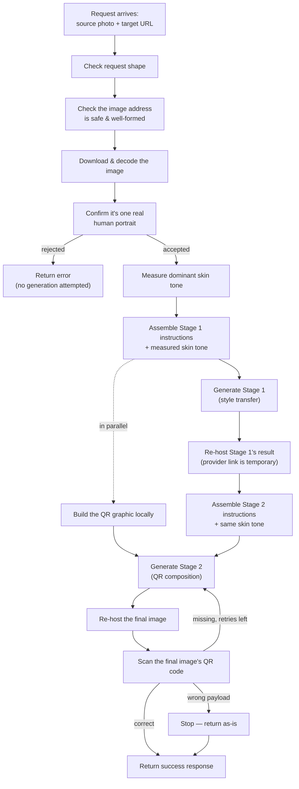

# Architecture Overview

> A plain-language guide for a new engineer joining the `ghibli_qr` project.
> It explains what the system does, what each part is responsible for, and how
> a request moves through it — without code, function names, or line numbers.
> For the full technical reference (exact modules, functions, error codes,
> concurrency settings, deployment config), see
> [SYSTEM_ARCHITECTURE.md](SYSTEM_ARCHITECTURE.md).

---

## 1. What the System Does

`ghibli_qr` is a backend API that turns a person's photo into a stylized
illustration of that same person holding a scannable QR code. It works in two
AI-driven steps:

1. **Stage 1 — Style transfer.** The uploaded portrait is redrawn as a
   hand-painted "Ghibli"-style illustration. The person must stay
   recognizable: same face, skin tone, ethnicity, hair or hijab, and clothing —
   only the art style changes.
2. **Stage 2 — QR composition.** The illustrated portrait from Stage 1 is
   combined with a generated QR-code graphic into one new image: the same
   illustrated person, now holding that QR code with both hands, facing the
   camera.

The QR code encodes a URL supplied by the caller. Before the system spends
money generating anything, it checks that the uploaded photo is actually
usable (a real photo of one person). After generation, it checks that the QR
code in the final image actually scans to the right URL — a generated image is
not "done" unless it's genuinely usable.

## 2. Core Technologies (in plain terms)

| Concern | What's used | Why |
|---|---|---|
| Web API | A Python async web framework | Handles incoming HTTP requests without blocking on slow network calls |
| Image generation | An external AI image-generation provider | Does the actual creative work for Stage 1 and Stage 2 — this system doesn't generate images itself, it orchestrates calls to a provider |
| Portrait validation | A pretrained image-classification AI model | Cheaply decides "is this a real, single-person photo?" before any paid generation call |
| Image editing | A general-purpose image library | Resizes, decodes, and composites images (e.g. pasting a QR code onto a template) |
| QR generation & reading | QR-code libraries | Build the QR graphic and later read it back out of a generated image to confirm it's correct |
| Packaging & containers | Standard Python packaging + Docker | Reproducible local runs and deployment |

Two AI models are involved, doing two unrelated jobs: one **classifies**
whether an input photo is acceptable (a yes/no decision), the other
**generates** new images (the creative work). They never call each other.

## 3. System Components and Their Roles

The codebase is organized so each part has exactly one job. Understanding
these roles matters more than memorizing file names — but the loose mapping
between the two is included so an engineer can find things quickly.

### API layer
Receives every HTTP request, checks that its shape and types are correct
(e.g. required fields present, correct format), and — no matter what happens
downstream — always sends back a response in one consistent envelope: success
or failure, a data payload, and an error list. Callers never have to guess the
shape of a response.

### Orchestrator
The "conductor" of the whole operation. For each endpoint, it knows the
*order* of steps that need to happen — validate, generate Stage 1, generate
Stage 2, verify — and calls into the right component for each one. It does not
do any image processing or talk to the AI provider itself; it only sequences
the work and decides what to do when a step fails (stop and return an error,
retry, or continue).

### Validation
Decides whether an uploaded image is acceptable *before* any paid AI call is
made. This is split into a few distinct, ordered checks, each answering one
question and nothing else:

- Is the image address well-formed and safe to fetch (not pointing at an
  internal/private address)?
- Can the image actually be downloaded and opened as a real image file?
- Does the image show exactly one real human being — not a cartoon, a
  drawing, an animal, an empty scene, or a group of people?

Only after all of these pass does the system move on to Stage 1. Once Stage 1
succeeds, its output is **trusted** — the system does not re-run the same
strict checks on its own AI-generated output, since that would be redundant
and would slow every request down for no benefit.

Along the way, this component also measures the person's dominant skin tone
directly from the uploaded photo. That measurement is later fed into the AI
generation prompts so the style-transfer step has a concrete, objective target
for "keep the same skin tone" instead of relying on the model's own judgment.

### Image generation
The bridge to the external AI provider. It takes a prompt (instructions) and
one or more reference images, and returns a newly generated image. It handles
the mechanics of talking to the provider — packaging images the way the
provider expects, sending the request, and waiting for the result — but has no
opinion about *why* it's being called or what happens with the result
afterward. It's used twice per full operation: once for style transfer, once
for QR composition.

### QR service
Two related but separate responsibilities:
- **Building** the QR-code graphic that gets shown to the AI provider as a
  reference image for Stage 2 (pure local image composition — no AI, no
  network call, effectively instant).
- **Verifying**, after Stage 2 completes, that the final generated image
  actually contains a QR code, and that scanning it produces the exact URL the
  caller originally asked for. This uses a fast method first and only falls
  back to a slower, more thorough detection method if the fast one finds
  nothing.

### Storage
The AI provider's generated-image links are temporary — they expire. So
every image the system produces or receives (the Stage 1 illustration, the QR
graphic, the final composed image) is downloaded once and re-saved locally,
then served back to the caller from this system's own domain. This guarantees
the links in the response stay valid, and gives the system a place to clean up
old files automatically after a set retention period.

### How these communicate
Everything above lives in a single running process and talks to each other
through direct calls — there is no message queue or separate microservice to
reason about. The one asynchronous idea worth knowing: because the AI
provider's calls can take a while, the orchestrator submits a generation
request and then *waits* for it to complete rather than blocking the whole
server; other work (like building the QR graphic) happens during that wait
instead of after it, so the two don't add to each other's latency.

## 4. Project Structure

```
ghibli_qr/
├── src/ghibli_portrait/
│   ├── main.py            # Application startup/shutdown, background cleanup
│   ├── config.py          # All settings, plus the AI prompt text
│   ├── api/                # Endpoints and the orchestrator
│   ├── models/             # Request/response shapes (schemas)
│   ├── services/           # Validation, generation, QR build/verify — one file per responsibility
│   └── utils/               # Small shared helpers
├── src/static/
│   ├── lock.png            # Template graphic used when composing Stage 2
│   └── tmp/                # Generated/re-hosted images, served back to callers
├── docs/                    # Documentation (this file, the full reference, the runbook)
├── tests/                   # Automated test suite
└── Dockerfile / docker-compose.yml   # Containerized deployment
```

**Where to look first:** `api/` to see how a request is handled end to end,
`services/` to see what each processing step actually does, and `config.py`
for every setting plus the exact prompt text sent to the AI provider (a lot of
the product's behavior — like "preserve skin tone" — is defined there in plain
English, not in code logic).

## 5. API Surface (What You Can Call)

| Endpoint | Purpose |
|---|---|
| Health check | Confirms the service is up and ready |
| Style transfer only | Runs Stage 1 alone — photo in, illustrated portrait out, no QR |
| QR-lock graphic only | Builds just the QR overlay image, no AI call at all |
| Delete a temporary image | Removes a previously generated file by name |
| URL shortening | A small deterministic utility, unrelated to image generation |
| **Full pipeline (primary)** | Runs the complete photo → styled portrait → portrait-holding-QR flow described below |

The full pipeline endpoint is the one production callers actually use; the
others exist mostly for debugging Stage 1 in isolation, or for utility needs.

## 6. Main Lifecycle: the Full Pipeline, Step by Step

This is the sequence the orchestrator drives for the primary endpoint. Every
step from validation onward can end the operation early with an error instead
of continuing — the list below is the "happy path."



**In words:**

1. **A request comes in** with a source photo and a target URL to encode.
2. **The request is checked for correct shape** — missing or malformed fields
   are rejected immediately, before touching any image.
3. **The image address is checked** for being a plausible, public link — no
   download happens yet at this point.
4. **The image is downloaded and opened.** A broken link or non-image file
   stops here.
5. **The image is classified** to confirm it's a real photo of exactly one
   person. Anything else (cartoon, drawing, animal, empty scene, group photo)
   is rejected here, before any paid AI call happens.
6. **The dominant skin tone is measured** from that same image — no second
   download, it reuses the image already in memory.
7. **Stage 1's instructions are assembled**: the standard style-transfer
   instructions plus the measured skin tone, so the AI has a concrete target
   to preserve rather than a vague one.
8. **Stage 1 is generated.** The system submits the photo and instructions to
   the AI provider and waits for the illustrated result. While waiting, the QR
   graphic is built locally at the same time, since it doesn't depend on
   Stage 1 finishing.
9. **Stage 1's output is re-hosted** — downloaded once and saved on this
   system's own storage, since the provider's own link would expire.
10. **Stage 1's output is trusted**, not re-validated — only a basic sanity
    check confirms something was actually returned.
11. **Stage 2's instructions are assembled**: keep the same person from
    Stage 1, holding the QR graphic with both hands, facing forward — plus the
    same measured skin tone.
12. **Stage 2 is generated**, using both the re-hosted Stage 1 illustration and
    the QR graphic as reference images.
13. **The final image is re-hosted** the same way Stage 1's was.
14. **The final image is scanned** to confirm a QR code is present and decodes
    to the exact URL the caller requested.
    - If no QR code is found at all, the system assumes the AI provider
      dropped or obscured it, and retries Stage 2 a limited number of times.
    - If a QR code is found but decodes to the wrong text, the system does
      *not* retry — that's treated as a different kind of failure and returned
      as-is for a human to look at.
15. **A single response is returned**, containing the final image's link, the
    intermediate Stage 1 link (useful for isolating which stage went wrong),
    the measured skin tone, and whether the QR code passed verification.

Two smaller operations reuse the same building blocks: style transfer alone
(steps 1–10, no QR), and the QR graphic alone (just step 8's parallel branch,
no AI call).

## 7. The Two AI Models, and Why They're Separate

| Model | Job | When it runs |
|---|---|---|
| **Classification model (CLIP-style)** | Answers a yes/no question: "is this a real photo of exactly one human?" | Once, early, before any generation — it's the gate that prevents wasted spend on unusable input |
| **Generation model** | Produces new images from a prompt and reference images | Twice per full operation — once for style transfer, once for QR composition |

The classification model is deliberately cheap and fast compared to
generation, so rejecting bad input early saves real cost. It's also
**fail-closed**: if the classifier itself errors out for any reason, that's
treated as a rejection, not a silent pass-through — the system never generates
an image it couldn't actually validate.

Because the generation model does the creative work, most of the "keep this
person's identity intact" logic lives in the *instructions* given to it —
plain-English prompt text describing exactly what must and must not change —
rather than in separate code logic. The measured skin-tone value (step 6/11
above) is the one piece of *objective, measured data* injected into those
instructions, grounding an otherwise subjective request.

## 8. Error Handling & Retries, at a Glance

- **Input problems** (bad URL, unreachable image, wrong content) are rejected
  immediately with no generation attempted — the caller gets told exactly
  which check failed.
- **Provider problems** (the AI service errors out or times out) surface as a
  failure for that stage; a small number of attempts are allowed for
  rate-limit-style failures specifically.
- **QR-specific outcomes** are handled more precisely than a plain
  pass/fail: a missing QR code is retried automatically (the model likely
  botched the composition), while a QR code that scans to the *wrong* value is
  returned as-is, since retrying wouldn't obviously fix a systematic issue.
- Every outcome — success or failure — is returned through the same response
  shape, so callers always know where to look for the result or the reason it
  failed.

## 9. Storage & Cleanup, at a Glance

Generated images accumulate on local storage as they're produced, since the
AI provider's own links expire. A background process periodically removes
older temporary files (intermediate Stage 1 and QR-lock images sooner, final
composed images later) so storage doesn't grow unbounded, while still keeping
recently generated results available to callers who fetch them after the
initial response.

## 10. Where to Read Next

- [SYSTEM_ARCHITECTURE.md](SYSTEM_ARCHITECTURE.md) — the full technical
  reference: exact modules and functions, error codes, concurrency limits,
  code-level request traces, and deployment specifics.
- [RUNBOOK.md](RUNBOOK.md) — how to run, configure, and troubleshoot the
  system locally or in Docker.
