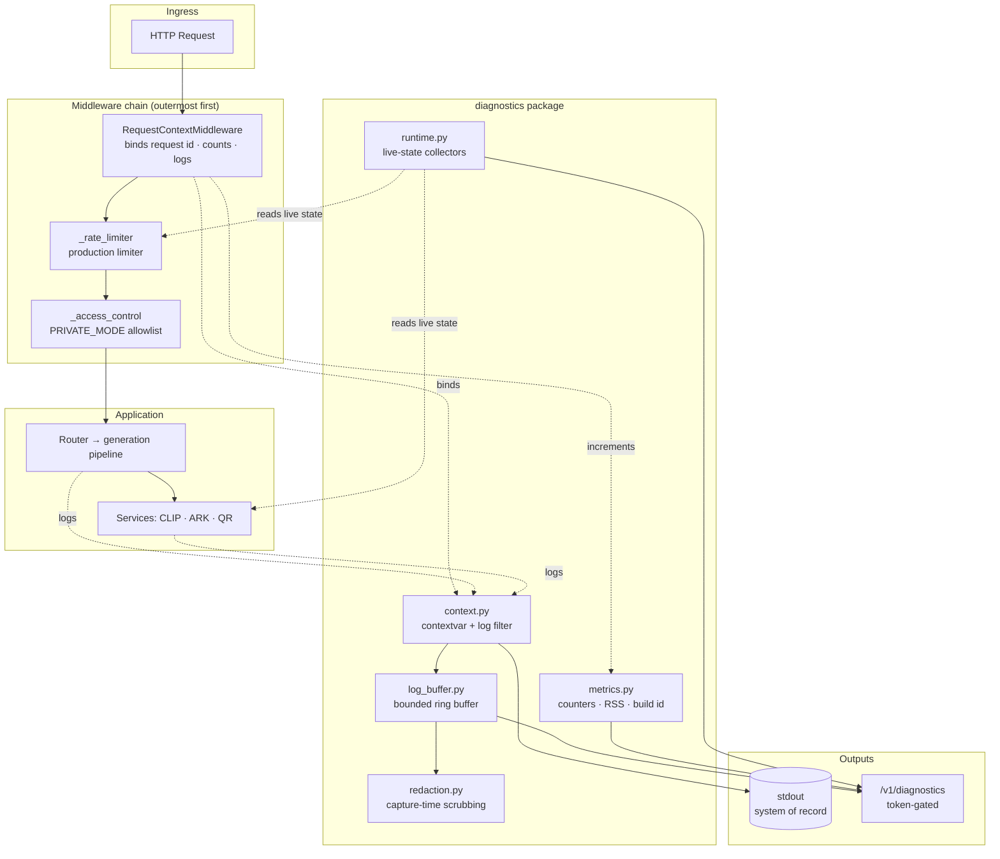
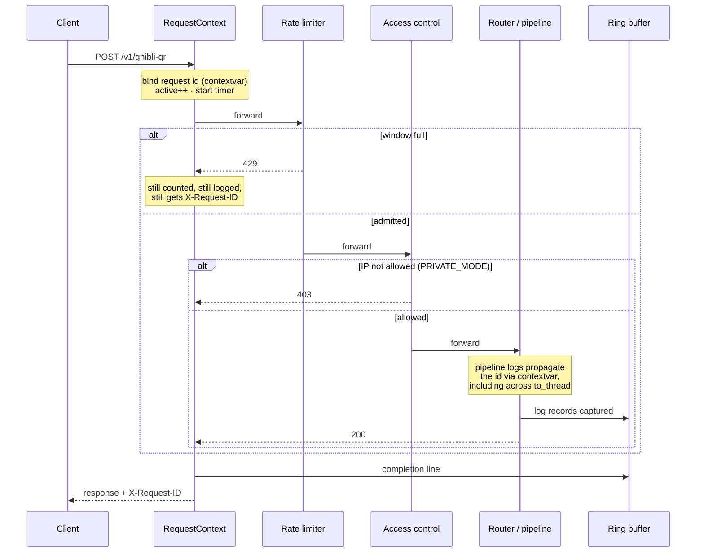
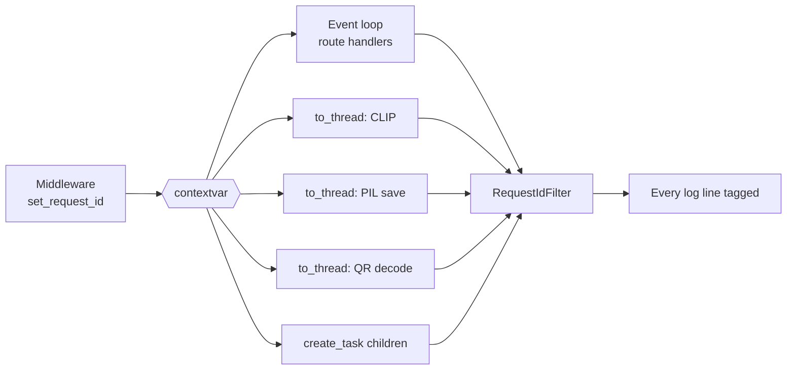
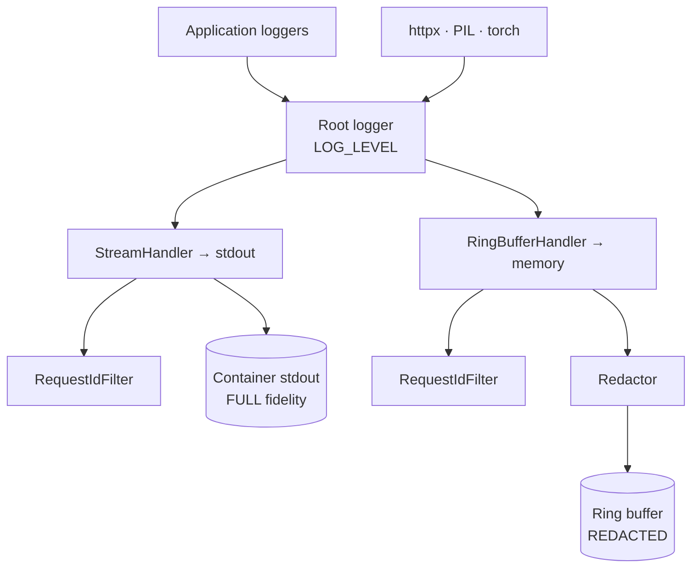
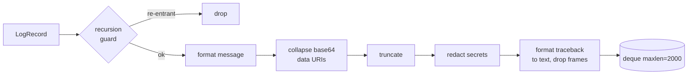
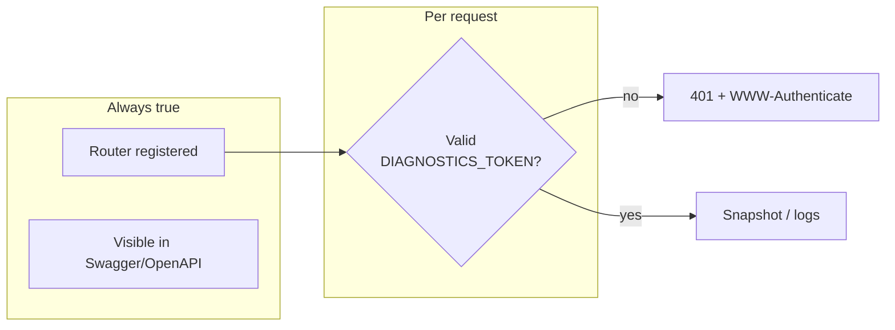
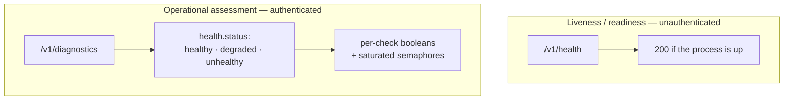
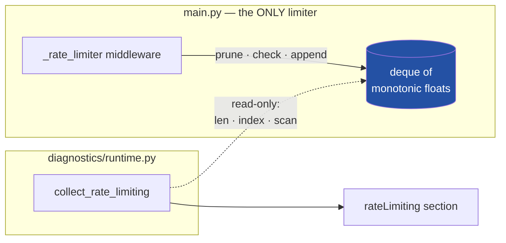
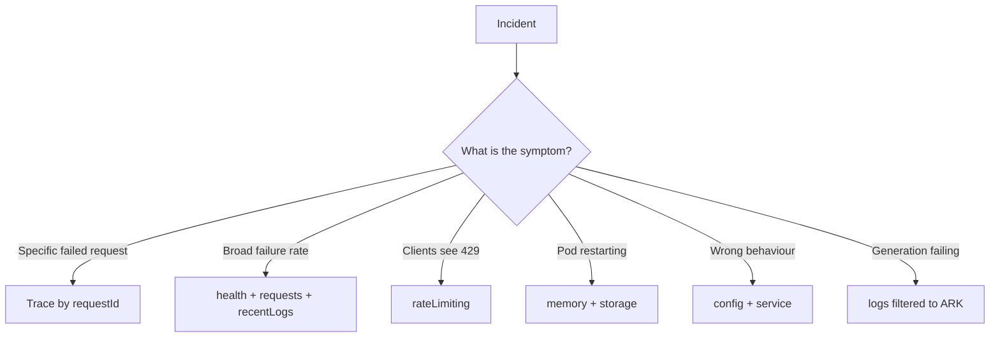
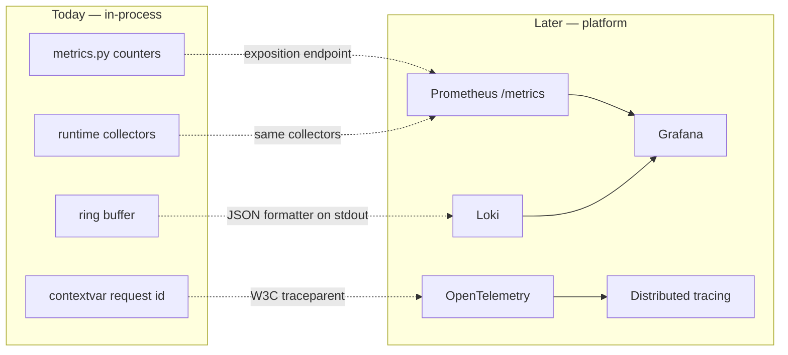

# Operational Diagnosability — Architecture

**Audience:** Platform, DevOps, SRE, Backend, and Production Operations engineers taking
ownership of this service.

**Scope:** the architecture of the diagnostics subsystem — what it is, why it is shaped the
way it is, and how to operate it. This is not an API reference; endpoint parameters live in
Swagger (`/docs`) and operational command recipes live in [RUNBOOK.md §9](RUNBOOK.md).

---

## 1. Executive Summary

This service is a stateless AI microservice: it accepts a portrait, calls BytePlus ARK twice,
validates the QR result, and returns an image URL. It has **no database**, holds no user
state, and runs as a **single process with a single worker** — a hard constraint, because the
generation pipeline keeps in-flight task state in process memory.

That architecture makes it fast and simple to reason about, and almost impossible to debug
from the outside. A request that fails at 03:00 leaves nothing behind: no row to query, no
job record, no trace. Before this subsystem existed, seventeen distinct error paths returned
HTTP failures while logging **nothing at all**, and the request id existed only inside one
function — never reaching the client, never reaching the service layer. With up to 24
concurrent generations interleaving their log lines, correlating one request's journey was
not merely hard, it was not possible.

The diagnostics subsystem closes that gap with three layers:

| Layer | Purpose |
|---|---|
| **Request correlation** | Every request carries an id, from ingress through worker threads to the response header |
| **Log capture** | A bounded in-memory ring buffer holding recent, secret-redacted log records |
| **Diagnostics API** | One authenticated endpoint aggregating live runtime state |

The governing design principle: **observe, never own.** The subsystem reads state that
already exists — the rate limiter's window, the concurrency semaphores, the task registry,
the model singletons. It does not maintain a parallel copy of any of them. Where a value
genuinely cannot be read from the live system, the payload says so rather than estimating it.

---

## 2. Why the Diagnostics Subsystem Exists

Three properties of this service, each individually reasonable, combine into an
observability problem:

**It is stateless.** No database means no audit trail. When a generation fails there is no
record to inspect afterwards — the evidence exists only in process memory and stdout.

**It is expensive per request.** Every call to `/v1/ghibli-qr` triggers two billed BytePlus
ARK generations, averaging ~48 seconds end to end. A failure is not just a bad response; it
is money already spent. Understanding *why* something failed has direct cost consequences.

**It is highly concurrent inside one process.** Up to 24 generations run simultaneously,
each hopping between the event loop and worker threads. Their log lines interleave. Without
correlation, "the ARK call failed" is unattributable to any particular request.

Add the operational reality that a container may be running on infrastructure where you do
not have shell access, and the requirement becomes concrete: **the service must be able to
explain its own state over HTTP, to an authenticated operator, without a restart.**

---

## 3. Production Problems It Was Designed to Solve

Each of these was a real, verified gap — not a hypothetical.

| Problem | Consequence before | Addressed by |
|---|---|---|
| 17 error paths logged nothing | A 422 or 500 left zero trace; you knew a request failed but not why | Log lines on every error path, at levels matched to cause |
| Request id never left one function | The `[GEN]`/`[ARK]`/CLIP lines of 24 concurrent requests were indistinguishable | Contextvar-based correlation across all layers + `X-Request-ID` |
| Logs only reached stdout | Diagnosis required shell or `kubectl logs` access | In-memory ring buffer readable over HTTP |
| No visibility into live state | Semaphore saturation, queue depth, and model load state were unknowable | Aggregated runtime snapshot |
| Rate limiter had no introspection | "Are we rejecting traffic right now?" was unanswerable | Read-only view of the limiter's live window |
| No memory visibility | The container was OOM-killed at a 2 GB limit before anyone could measure actual RSS | Current and peak RSS in the snapshot |
| Secrets in logs | An ARK error echoing the request could put a base64 payload — or worse — into a log line | Capture-time redaction |

That penultimate row is worth dwelling on: the memory ceiling was set from an estimate, the
estimate was wrong, and the service was OOM-killed under real load. Exposing measured RSS
turns that class of question from an argument into a reading.

---

## 4. High-Level Architecture

Four modules, deliberately self-contained. The `diagnostics` package imports nothing from the
application at module level, because it is installed **before** the application is imported.

Note the direction of the dotted arrows from `runtime.py`: they point **into** the running
system. `runtime.py` is a reader. Nothing flows back.

---

## 5. Runtime Request Lifecycle

The middleware order is load-bearing and was chosen deliberately. Starlette makes the
**last-registered** middleware the **outermost** layer; `RequestContextMiddleware` is
registered last for that reason.

**Why context is outermost.** If `RequestContextMiddleware` sat inside the rate limiter,
requests rejected with 429 or 403 would never be assigned an id, never be counted, and never
be logged — making exactly the requests you most want to investigate invisible. Placing it
outermost costs nothing and guarantees that *every* request, including rejected ones, is
observable. This is verified behaviour: a `PRIVATE_MODE` 403 and rate-limited 429s all carry
`X-Request-ID` and appear in the 4xx counters.

---

## 6. Request Correlation

Correlation uses a **contextvar**, not a parameter threaded through call signatures.

The reason is specific to this codebase: the pipeline hands work to worker threads at
**16 separate `asyncio.to_thread` call sites** — CLIP classification, PIL encoding, QR
decoding, skin-tone extraction. `asyncio.to_thread` copies the current context into the
worker thread, so a contextvar set once at ingress is visible in all of them without touching
a single service function's signature.

Two design details matter operationally:

**The filter attaches to handlers, not loggers.** A handler-level filter sees every record
reaching that handler, including records propagated up from child loggers and from
third-party libraries. This is why `httpx` request lines — which show the actual ARK calls —
are correlated too, despite `httpx` knowing nothing about this service.

**Inbound ids are validated, not trusted.** A client-supplied `X-Request-ID` is accepted only
if it matches `^[A-Za-z0-9._:-]{1,64}$`; anything else is replaced with a generated id. This
is a log-injection control, not cosmetics: stdout is line-oriented, so a CRLF inside a
client-controlled id would let that client forge arbitrary log lines.

> ⚠️ **`loop.run_in_executor` does not copy context.** This codebase uses `asyncio.to_thread`
> at every thread boundary (verified: zero `run_in_executor` call sites). Introducing
> `run_in_executor` would silently break correlation for that path.

---

## 7. Logging Architecture

Logging is configured **once**, centrally, in `main.py` — before any project module is
imported. That ordering is not stylistic. Python's logging module gives an unconfigured
logger a last-resort handler that silently discards anything below `WARNING`; module-level
loggers created during import would inherit it. Configuring first means every module's
`getLogger(__name__)` picks up a real handler.

**The asymmetry between the two sinks is intentional.** Redaction applies only to the buffer.
Container stdout keeps full fidelity, because access to `kubectl logs` is already controlled
by the platform's RBAC — whereas the buffer is readable over HTTP by anyone holding a bearer
token. Redact where the weaker control is.

Log levels follow a consistent convention, so that filtering by level is meaningful rather
than arbitrary:

| Situation | Level |
|---|---|
| 4xx caused by the caller | `WARNING` |
| 5xx originating from an external provider | `ERROR` |
| Unexpected 5xx | `ERROR` + traceback |
| Timeouts | `WARNING` |
| Expected, recoverable internal fallbacks | `DEBUG` |
| Health probes, static files, `/docs` | `DEBUG` |

That last row prevents a Kubernetes readiness probe firing every 10 seconds from evicting
real request traces out of a bounded buffer.

---

## 8. Ring Buffer Design

A `collections.deque` with `maxlen`, wrapped in a `logging.Handler` attached to the root
logger. It captures every application logger and every third-party one without a single call
site being aware of it.

Four properties are worth understanding before you tune it.

**Bounded memory, three independent ways.** Entry count (`DIAG_LOG_BUFFER_SIZE`, default
2000), per-message characters (default 2000), and per-traceback characters (default 4000).
Worst case ≈ 12 MB; typical ≈ 1.5 MB, against a container limit measured in gigabytes.

**Data URIs are collapsed *before* truncation.** This ordering is what makes the memory
ceiling real. The service inlines reference images as base64 data URIs of 200–400 KB, and an
ARK error can echo the request back into an exception message. Truncating first would still
store 2000 characters of base64; collapsing first reduces a 50 KB data URI to roughly
58 bytes.

**Tracebacks are stored as text, and the frames are dropped.** A live `exc_info` tuple holds
frame objects, and frames hold local variables — in this codebase, decoded PIL images and
those same base64 payloads. Retaining them would pin megabytes per entry for the buffer's
lifetime.

**Thread safety is inherited, not added.** Records arrive from the event loop, from 16
`to_thread` sites, and from a 100-worker executor. `logging.Handler.handle()` already
serialises `emit()` behind its own lock, so no second lock exists — adding one would
duplicate contention for no benefit.

Sequence numbers survive eviction, which is what makes `sinceSeq` tail-polling reliable: a
poller can detect that entries were dropped between polls rather than silently missing them.

---

## 9. Diagnostics API Architecture

The API is **always registered and always visible in Swagger**. Access is controlled
exclusively by a token.

This reverses an earlier design in which the router was unregistered when disabled. That
approach hid the endpoint from operators as effectively as from attackers, and required a
configuration change plus a restart to enable. The current split is cleaner:

**Discoverability is not access.** An engineer can find the endpoint and read its contract
without touching configuration; using it requires a credential. Enabling access is a secret
change, not a deployment.

Four endpoints, with the aggregation deliberately concentrated in one:

| Endpoint | Role |
|---|---|
| `GET /v1/diagnostics` | The operational dashboard — one call, full picture |
| `GET /v1/diagnostics/logs` | Filtered log querying (`requestId`, `level`, `contains`, `sinceSeq`) |
| `GET /v1/diagnostics/logs/stats` | Aggregates and recent errors |
| `DELETE /v1/diagnostics/logs` | Administrative buffer clear |

The primary endpoint aggregates rather than fragmenting across a dozen routes because the
incident-response question is almost never "what is the CLIP semaphore doing" in isolation —
it is "what is going on", and correlating across sections is where the answer usually lives.

---

## 10. Runtime Metrics

Metrics are process-lifetime counters, incremented in the outermost middleware. No metrics
library, no Prometheus client, no registry.

| Group | Fields |
|---|---|
| Volume | `totalRequests`, `activeRequests`, `peakActiveRequests` |
| Outcome | `byStatusClass`, `errorsTotal`, `errorRate`, `rateLimitedResponses`, `unhandledExceptions` |
| Latency | `avgDurationMs` |
| Distribution | `byEndpoint`, `lastErrorAt` |
| Process | current RSS, peak RSS, uptime, pid, git commit, environment |

Two containment decisions:

**Endpoint keys use the matched route template**, not the concrete path — so
`DELETE /v1/qr-lock/{img_id}` is one key rather than one per image id. A scan of random URLs
cannot inflate cardinality, and the map is hard-capped at 64 keys regardless.

**Counter updates require no lock.** Every HTTP request is handled on the event-loop thread,
so integer increments cannot race. The cost is a few nanoseconds against a pipeline whose
median is ~48 seconds.

RSS is read from `/proc/self/status` (`VmRSS`) with a `resource.getrusage` fallback for peak.
No `psutil` dependency. Current RSS is the number that matters against a container limit;
peak is what tells you whether you came close to being OOM-killed since start.

---

## 11. Health Monitoring

There are two health surfaces, and conflating them causes incidents.

`/v1/health` is a **process liveness** signal, consumed by the Kubernetes probes and the
Docker healthcheck. It is intentionally shallow and intentionally exempt from `PRIVATE_MODE`,
because the kubelet's IP is never on an allowlist and a 403 would fail the probe.

> ⚠️ **A passing `/v1/health` does not mean the pipeline works.** It confirms the process is
> answering HTTP. It does not verify that CLIP loaded, that QReader loaded, or that ARK is
> reachable. Treat it as "is it alive", never as "is it working".

The diagnostics `health` block is the deeper assessment, derived entirely from state the
process already holds — it makes **no outbound calls**, so polling it can never itself
consume an ARK request or add pipeline latency:

- `unhealthy` — a required component is missing (CLIP or QReader not loaded, ARK key absent,
  `DOMAIN` unset)
- `degraded` — a concurrency semaphore has waiters; the service is serving but queuing
- `healthy` — all checks pass, nothing queuing

---

## 12. Rate Limiting Observability

The service has one production rate limiter, protecting the two billed generation endpoints.
Diagnostics **reads** it. It does not wrap it, mirror it, or reimplement it.

### What the limiter is

A hand-rolled sliding window on a module-level `collections.deque` of monotonic timestamps.
No library, no Redis. Critically, it is **global** — every caller shares one window. There are
no per-client buckets, and the deque contains only floats: no IPs, no keys, no identifiers.

### How diagnostics reads it

The collector performs an `O(1)` length read, an `O(1)` endpoint index, and a left-to-right
scan that **stops at the first non-expired entry**. It never calls `popleft`, never appends,
never assigns.

**Why read-only is a correctness requirement, not a preference.** The limiter prunes expired
entries lazily — only when a rate-limited path is hit. If diagnostics pruned while reading,
it would free capacity, and *observing* the system would change which requests get admitted.
A monitoring endpoint that alters request admission is a bug, not a feature.

That lazy pruning also means `len(deque)` alone over-reports once traffic stops, so the
payload distinguishes two numbers:

- **`requestsInWindow`** — non-expired entries; the number that actually governs admission
- **`trackedEntries`** — what is physically held, including entries not yet pruned

### Single source of truth

Because the collector dereferences the limiter's own deque, there is exactly one place where
this state lives. There is no synchronisation to drift, no cache to invalidate, no second
counter to disagree. The repository contains exactly **one** sliding-window deque, **one**
HTTP 429 emitter, and **one** limiter middleware. If the limiter's policy changes, diagnostics
reports the new behaviour with no corresponding change — because it never encoded the old one.

### What cannot be read, and why

Two fields a reader might expect are deliberately absent rather than fabricated:

**Per-bucket statistics.** There are no buckets. The limiter is a single global window.
Reporting `activeBuckets: 1` would imply a bucketed design that does not exist, so the payload
reports `scope: "global — all callers share one window"` instead. This is operationally
important: `currentlyLimiting: true` means *the whole service* is at capacity, not that one
client is noisy. There is no per-caller view to drill into.

**A limiter-side rejection counter.** The deque stores only *allowed* timestamps; rejections
are never recorded by the limiter. Rather than leave the field blank, 429 responses are
counted at the HTTP layer by the diagnostics middleware, which already records every response
status. The payload discloses this provenance in `rejectedCounterSource`. The count is exact
rather than estimated, because that limiter is the only source of HTTP 429 in this service —
the ARK-side 429 handled during generation is converted to a `500 STAGE1_API_ERROR` and never
reaches the client as a 429.

---

## 13. Security Model

### Authentication

Every diagnostics request requires a token, presented as `X-Diagnostics-Token` (preferred) or
`Authorization: Bearer`. The dedicated header is preferred because this service is intended to
sit behind a platform gateway that owns `Authorization` for end-user identity; keeping the
diagnostics credential on its own header means the two can never collide.

| Property | Behaviour | Rationale |
|---|---|---|
| Comparison | `secrets.compare_digest` on bytes | Constant-time; bytes because the header is attacker-controlled and non-ASCII `str` would raise |
| Absent credential | Comparison still runs against `""` | "No credential" and "wrong credential" are timing-identical |
| **Unset token** | **All requests 401** | An absent secret must fail closed. It can never degrade into anonymous access |
| Failure response | `401` + `WWW-Authenticate` | Correct HTTP semantics; the endpoint is already public in Swagger, so hiding it buys nothing |
| Weak token | Warning at startup, service continues | Refusing to boot over a diagnostics misconfiguration would take down image generation — the wrong failure mode |

### Why secrets are never exposed

Two independent mechanisms, at different layers:

**Configuration uses an allow-list.** The `config` section enumerates specific settings.
`os.environ` is never dumped, whole or filtered. An allow-list fails closed when someone adds
a new secret env var; a deny-list fails open. Credentials appear only as a presence boolean
plus a non-invertible `sha256` fingerprint — enough to answer "is the right key mounted in
this pod?" without being reversible.

**Logs are redacted at capture time**, before an entry enters the buffer — not at read time.
The risk being removed is a secret sitting in process memory inside a structure an HTTP
endpoint serialises; redacting on read would leave it there for any future reader, and would
re-run on every poll.

Redaction order matters: data URIs collapse first (before truncation), then exact secret
values, then bearer tokens, then key/value secret patterns, then URL query strings. URLs keep
host and path — which is what you need to reproduce a failure — while the query string, which
carries signed-CDN credentials, is stripped.

### Authorization and intended use

There is no authorization model, because there are no roles: the token is a single shared
operational credential. This is appropriate for internal tooling and **not** appropriate as a
public API surface. Treat the token as a real credential — rotate it, store it in the
platform's secret manager, and prefer an ingress source-range allowlist as defence in depth.

> ⚠️ **Known residual signal.** Because the routes are registered, a request with a wrong HTTP
> method returns 405 while an unregistered path returns 404. Combined with public Swagger, the
> endpoint's existence is not secret. The token still blocks all access; this is an accepted,
> deliberate trade of concealment for discoverability.

---

## 14. Performance Considerations

The subsystem is designed so that its cost is invisible next to a ~48-second pipeline
dominated by two network calls to ARK.

| Component | Cost | Notes |
|---|---|---|
| Request id binding | ~ns | One contextvar set, one reset |
| Counter updates | ~ns | Integer increments, no lock (event-loop thread only) |
| Log capture | ~10 µs/record | Message format (stdout pays this anyway), ~6 precompiled regexes over a ≤2 KB string, one deque append |
| Snapshot read | µs–ms | `O(1)` reads; the only scan is bounded by the rate limiter's own max |
| Storage scan | Off-loop | `glob`/`stat`/`disk_usage` are blocking syscalls, dispatched via `to_thread`, capped at 5000 files |

At 24 concurrent requests producing ~30 log records each, total added CPU is well under one
millisecond per request.

**No duplicated runtime state.** This is the property that keeps the cost bounded and the data
trustworthy:

| State | Owner | How diagnostics gets it |
|---|---|---|
| Rate limiter window | `main.py` deque | Dereferenced live, read-only |
| Concurrency saturation | `TrackedSemaphore` in the request path | Two public integers the semaphore already maintains |
| In-flight generations | `pending_tasks` registry | Length + a bounded key sample, no `await` between reads |
| Model load state | Service module singletons | A stdlib-only accessor returning booleans |
| Memory | Kernel, via `/proc` | Read on demand |
| Config | `Settings` | Allow-listed read |

The only state the subsystem *owns* is the log buffer and the request counters — neither of
which duplicates anything the application already tracks.

One nuance on `TrackedSemaphore`: it is an `asyncio.Semaphore` subclass adding two integer
counters, replacing the plain semaphores that gate the load-tested 24-way generation path.
It was chosen over reading `Semaphore._value` (private API) and verified to preserve blocking
semantics exactly, including that a cancelled waiter does not leak a `waiting` count.

---

## 15. DevOps Operational Workflow

Recipes with exact commands live in [RUNBOOK.md §9](RUNBOOK.md). This section covers the
*reasoning* — which signal answers which question.

**Start with the aggregated snapshot.** One call answers "what is going on" — `health` gives
the verdict, `requests` the error rate, `rateLimiting` whether you are rejecting, `memory` the
OOM risk, `recentLogs` the evidence. Drill into `/logs` only once you know what to look for.

### Investigating a failed request

If the client captured the `X-Request-ID` from the response, filter the logs by it in
ascending order. That returns the complete trace — validation, CLIP classification, both ARK
calls, re-hosting, QR verification — in execution order, across all loggers. If the id was not
captured, filter by `level=WARNING` over a recent window and work backwards from the error to
its request id, then re-filter by that id.

### Diagnosing high memory

Compare `memory.rssMb` against the container limit and `memory.peakRssMb` against it too. A
peak close to the limit with a lower current value means you have already come near an
OOM-kill. Baseline is roughly 1.1–1.2 GB with CLIP and QReader loaded; the container limit is
4 GB precisely because a 2 GB ceiling proved too tight under real concurrency. Cross-check
`concurrency` — sustained `waiting` counts mean requests are queuing, which raises the peak.

### Diagnosing rate limiting

`currentlyLimiting` answers whether the limiter is rejecting *right now*.
`requestsInWindow` versus `maxRequests` shows how close it is, and `windowResetInSeconds`
shows when capacity returns. `rejectedResponsesObserved` is cumulative since process start.

Because the limiter is global, a saturated window means the service as a whole is at capacity —
there is no per-client view, and no single caller can be identified from this data.

### Checking health

`health.status` plus `health.failedChecks`. An `unhealthy` verdict names the failing component
directly. `degraded` means saturation, not failure — the service is serving but queuing, and
the right response is usually capacity, not a restart.

### Validating runtime configuration

The `config` section reports **effective** values as the process actually resolved them —
which is the answer to "did that ConfigMap change actually apply?" Check
`arkApiKeyFingerprint` to confirm *which* key is mounted without revealing it, and
`service.gitCommit` plus `service.environment` to confirm which build is running where.

### Investigating ARK failures

Filter logs to the ARK service logger. Each generation logs the request shape before the call
and status plus elapsed time after; failures log the truncated provider response. Never expect
the API key in these lines — request headers are deliberately never logged. Correlate with
`pendingTasks.oldestAgeSeconds`: a large value means requests are waiting on ARK rather than
failing fast.

---

## 16. Operational Limitations

These are deliberate scope decisions. Knowing them prevents relying on the subsystem for
something it was never built to do.

**No persistent storage.** The buffer is in memory and dies with the process — including on
the OOM-kill or crash you most want to investigate. **Container stdout remains the system of
record.** Treat the API as a convenience for a *live* process, never as durable log storage.

**No distributed aggregation.** Every counter and the entire buffer are per-process. With
multiple replicas, a request through the ingress reaches whichever pod the load balancer
picked, and its trace exists only on that pod. Use `kubectl port-forward` to target a specific
pod. This is inherent to a single-process design, not a gap in the tooling.

**No historical analytics.** There is no time series, no retention policy, no downsampling.
Counters are cumulative since start and reset on restart. Questions like "what was the error
rate last Tuesday" are out of scope by construction.

**No modification of runtime state.** Aside from clearing the log buffer, every endpoint is
read-only. You cannot drain the limiter, resize a semaphore, evict tasks, or toggle
configuration. Diagnostics observes; it does not administer. This is what makes it safe to
poll a production process.

**No per-client attribution.** The rate limiter is global and stores no client identifiers, so
"which caller caused this" is unanswerable from diagnostics alone.

**Bounded by `LOG_LEVEL`.** The buffer holds only what the root level admits. At
`LOG_LEVEL=WARNING` it contains no `INFO` lines, so a request trace will be incomplete —
debugging a specific request usually means `LOG_LEVEL=DEBUG` and a restart.

---

## 17. Future Evolution

The current architecture was chosen to keep these paths open without rework. Each is additive.

**Prometheus.** The counters already exist and are already aggregated. Exposing them is an
additional endpoint rendering the same objects in exposition format — the collectors do not
change, and nothing about the existing snapshot needs to move.

**Loki / centralised logging.** Logs already go to stdout with a consistent, parseable format
including the request id. Shipping is a platform concern requiring no application change. If
structured ingestion is preferred, swapping the stdout formatter for a JSON one is a
single-line change that leaves the buffer, the filter, and every call site untouched.

**OpenTelemetry and distributed tracing.** This is the most natural evolution, because the
correlation layer is already shaped for it. `X-Request-ID` would become W3C `traceparent`, and
the contextvar would become an OTel span context — the propagation mechanism is identical, and
crucially the `asyncio.to_thread` boundaries already carry it. Instrumenting the ARK client
would then make external latency visible per span rather than only in aggregate.

**Distributed aggregation.** Should the service ever run multiple replicas, the per-process
limitation becomes real. The correct fix is not to make the buffer distributed — it is to ship
logs to a central store and let counters be scraped per pod and aggregated by the metrics
backend. The current design assumes exactly that division of responsibility, which is why it
deliberately does not attempt either.

One constraint to carry into any of this: the service is pinned to **one worker per
container** because the generation pipeline keeps in-flight task state in process memory.
Scaling is horizontal, via replicas. Any observability evolution should assume per-pod
collection with central aggregation, not shared in-process state.

---

## Related Documents

| Document | Purpose |
|---|---|
| [RUNBOOK.md](RUNBOOK.md) | Setup, deployment, and §9 operational command recipes |
| [ARCHITECTURE_OVERVIEW.md](ARCHITECTURE_OVERVIEW.md) | Application and pipeline architecture |
| [SYSTEM_ARCHITECTURE.md](SYSTEM_ARCHITECTURE.md) | Request flow and validation layers |
| `/docs` (Swagger) | Live endpoint reference, always current |
