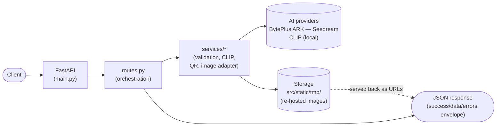
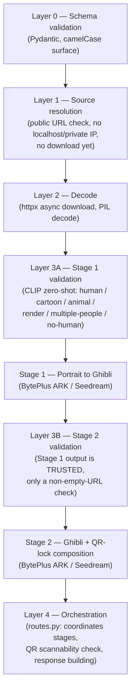
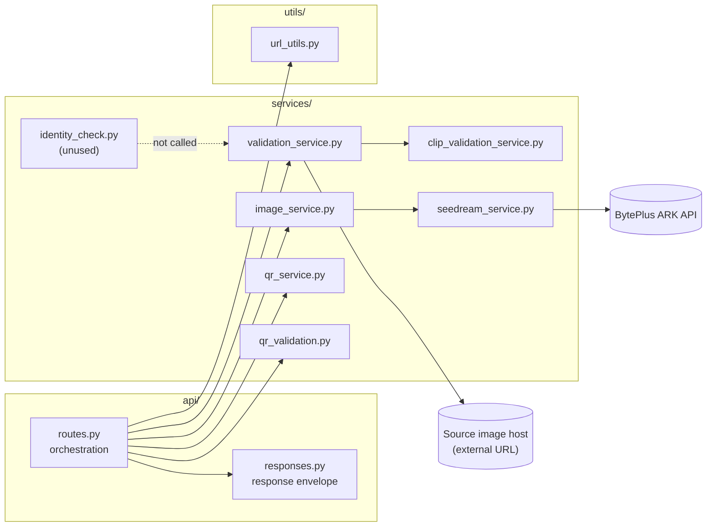
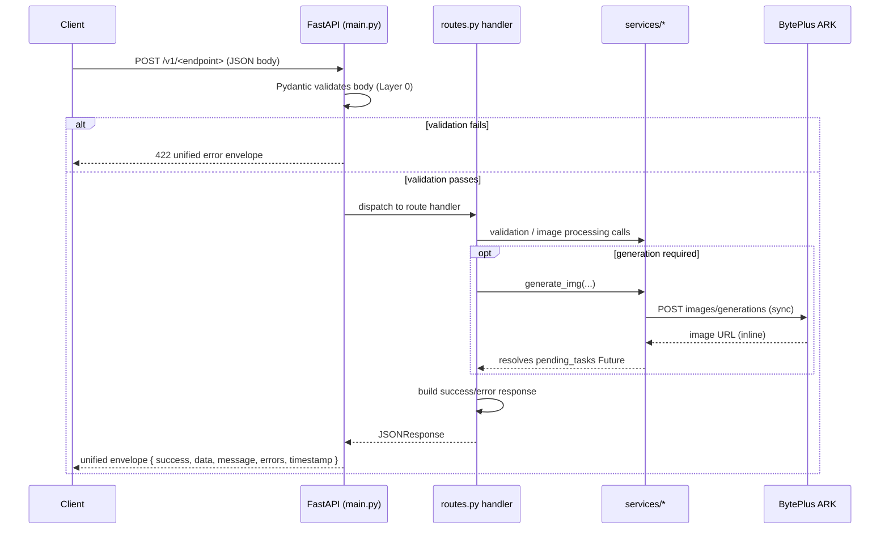
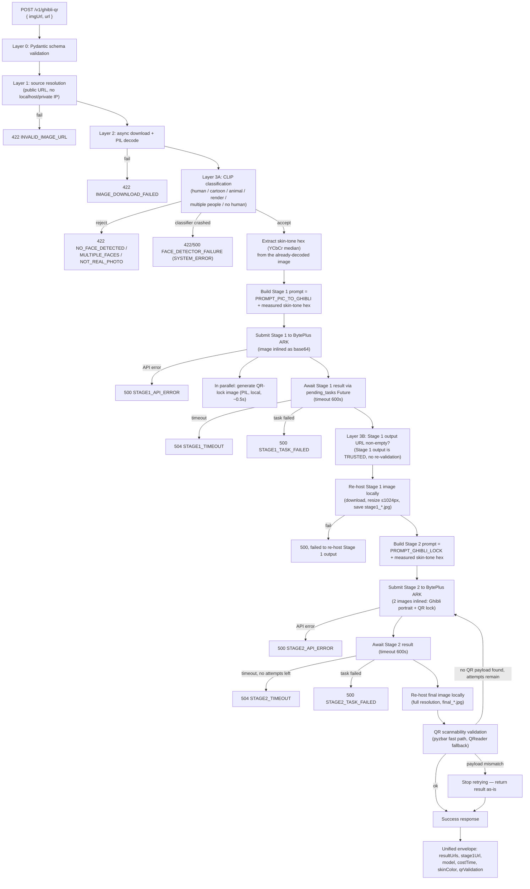
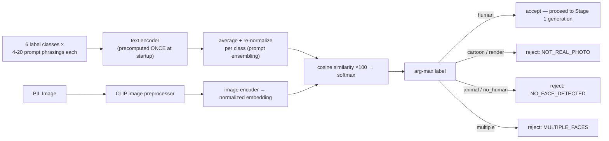
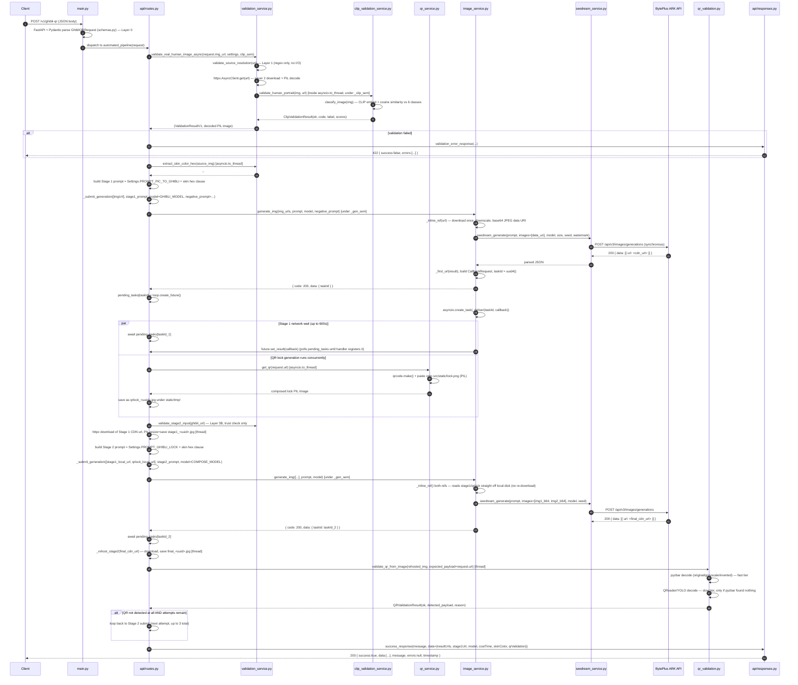

# System Architecture

> Audience: a new engineer joining the `ghibli_qr` project. This document explains
> what the system does, how the code is organized, and how a request flows through
> it end to end. It reflects the actual code on the `seedream` branch as of this
> writing, not aspirational design.
>
> For setup/run/test commands (local, Docker, ngrok question, troubleshooting), see
> the companion doc: **[RUNBOOK.md](RUNBOOK.md)**.

---

## 0. System Map (start here)

The shortest possible version of "how does a request move through this system":



Read left to right: the **Client** calls a `/v1/*` endpoint, **FastAPI** parses/
validates the body, **`routes.py`** decides the sequence of steps for that endpoint,
**services** do the actual work (validate, call an AI provider, build/check a QR
code), generated images get **re-hosted to local storage** (provider URLs are
temporary), and everything is wrapped into one unified **response envelope**.

Sections 2–4 below go into the folder layout, module responsibilities, and the
general per-request lifecycle in detail. Section 5 walks the primary
`/v1/ghibli-qr` endpoint step by step; Section 8 gives the full code-level trace.

---

## 1. System Overview

### 1.1 What the system does

`ghibli_qr` ("Ghibli Portrait API V1") is a production FastAPI backend that runs a
two-stage AI image pipeline:

1. **Stage 1** — takes a real portrait photo and turns it into a Studio Ghibli–style
   hand-painted illustration of the same person (same face, skin tone, ethnicity,
   hair/hijab, clothing — only the art style changes).
2. **Stage 2** — takes that Ghibli illustration plus a generated QR-code "lock" image
   and composes a new image of the same illustrated person holding the QR lock with
   both hands, front-facing.

The QR code encodes a caller-supplied URL. The final image is meant to be scannable —
the service verifies this before returning a response.

### 1.2 Main technologies

| Concern | Technology |
|---|---|
| Web framework | **FastAPI** (async), served by **uvicorn** |
| HTTP client (downloads, AI provider calls) | **httpx** (async) |
| Request/response schemas | **Pydantic v2** (camelCase API surface, snake_case Python) |
| Image processing | **Pillow (PIL)** |
| Image generation (AI) | **BytePlus ARK — Seedream** model, via a synchronous REST endpoint |
| Human-portrait validation (AI) | **CLIP** (`open_clip`, `ViT-B-32-quickgelu`, OpenAI weights) — zero-shot image classification |
| QR generation | **qrcode** |
| QR scannability check (AI/CV) | **QReader** (YOLO-based) + **pyzbar** (fast path) |
| Packaging / env | **uv** |
| Containerization | **Docker** / Docker Compose |
| Python | 3.10+ |

Two AI models are involved for two very different jobs: **CLIP** decides "is this a
real single-person portrait photo?" (a classification problem), while **Seedream**
does the actual image generation (Stage 1 and Stage 2). They are not related and do
not call each other.

### 1.3 High-level architecture

The README documents the request pipeline as a stack of validation "layers" followed
by two generation stages. This is the mental model the codebase is organized around
(`validation_service.py`'s module docstring spells out the same layering):



**Assumption / discrepancy worth knowing**: the README and `PROJECT_STATUS.md`
describe Stage 1 validation as "MediaPipe face detection + synthetic-image check".
That was true historically, but `mediapipe` has since been removed as a dependency
(see git history: *"chore: remove mediapipe dependency — not installed anymore"* and
*"feat(validation): wire CLIP into Stage 1, MediaPipe no longer used"*) and is **not
installed** in this environment. Stage 1 validation today runs entirely through
**CLIP** (`clip_validation_service.py`). The MediaPipe-based helper functions still
exist in `validation_service.py` and `identity_check.py` but are unreachable dead
code — see [§6.4](#64-dead-unused-code-you-will-find-while-reading) for details.

### 1.4 Generation model: synchronous, no webhooks

The BytePlus ARK `images/generations` endpoint is **synchronous** — it returns the
generated image URL inline in the HTTP response body. There is no callback/webhook
and therefore no need for a public tunnel (e.g. ngrok) during local development.

Internally, the code still uses an **in-process `asyncio.Future` registry**
(`pending_tasks` in `routes.py`) to hand the result back to the waiting request. This
is a deliberate compatibility shim: an earlier version of this service used an
asynchronous provider (KIE.ai) that really did call back via webhook, and the
orchestration code in `routes.py` was written against that "submit, then await a
Future" contract. `image_service.generate_img()` now fakes that contract on top of a
synchronous call so `routes.py` didn't need to be rewritten. See
[§6.3](#63-the-pendingtasks-future-shim-important-to-understand) — this is one of the
most important non-obvious things to understand before touching this code.

---

## 2. Folder Structure

```
ghibli_qr/
├── src/
│   ├── ghibli_portrait/
│   │   ├── main.py                  # FastAPI app, lifespan (startup/shutdown), tmp-file cleanup loop
│   │   ├── config.py                # Settings (env-driven) + the Stage 1/2 prompts
│   │   ├── api/
│   │   │   ├── routes.py            # All /v1 endpoints + pipeline orchestration (Layer 4)
│   │   │   └── responses.py         # Unified response envelope helpers + legacy response models
│   │   ├── models/
│   │   │   └── schemas.py           # Pydantic request/response schemas (camelCase API surface)
│   │   ├── services/
│   │   │   ├── image_service.py         # generate_img() — BytePlus ARK adapter, image inlining, Future delivery
│   │   │   ├── seedream_service.py      # Raw BytePlus ARK HTTP call (seedream_generate) + ARK settings
│   │   │   ├── clip_validation_service.py # CLIP zero-shot human-portrait classifier (Stage 1 gate)
│   │   │   ├── validation_service.py    # Layers 1/2/3A/3B validation, skin-tone extraction
│   │   │   ├── identity_check.py        # Identity-drift heuristic — DEAD CODE, not called anywhere
│   │   │   ├── qr_service.py            # Builds the QR-on-lock composite image (PIL)
│   │   │   ├── qr_validation.py         # Decodes/verifies a QR payload from an image (pyzbar/QReader)
│   │   │   └── qr_detect.py             # Standalone manual CLI script, not imported by the app
│   │   ├── utils/
│   │   │   ├── url_utils.py         # Deterministic URL shortening (uuid5-based)
│   │   │   └── image_utils.py       # normalize_image_url() — currently unused by the live request path
│   │   └── models/                  # (runtime) cached ML model weights are written here (e.g. MediaPipe .tflite, if used)
│   └── static/
│       ├── lock.png                 # Required asset — Stage 2 lock overlay template
│       └── tmp/                     # Generated/rehosted images served at GET /tmp/<file> (StaticFiles mount)
├── docs/                            # Design docs, dev reference, CLIP integration notes
├── tests/                           # Automated pytest suite (mocked, no network/paid calls)
│   ├── conftest.py                  # Shared fixtures (fake images, etc.)
│   ├── test_*.py                    # Unit tests per module
│   ├── fixtures/clip_regression/    # Real sample images used by tests/test_clip_prompt_regression.py
│   └── manual/                      # Scripts that DO hit live/paid APIs — excluded from pytest via pyproject.toml
├── output/                          # Optional local copy of final images (only if SAVE_OUTPUT_LOCAL=true)
├── Dockerfile                       # Multi-stage build; bakes CLIP weights in at build time
├── docker-compose.yml               # Single-service compose config (port, volumes, healthcheck)
├── pyproject.toml                   # Dependencies (uv-managed) + pytest config
├── .env / .env.example              # Runtime configuration (DOMAIN, ARK_API_KEY, feature flags)
└── README.md / QUICK_SETUP.md / IMPLEMENTATION_GUIDE.md / PROJECT_STATUS.md  # Top-level docs
```

### Key files a new engineer should know about first

| File | Why it matters |
|---|---|
| `src/ghibli_portrait/api/routes.py` | The orchestration logic for every endpoint lives here. Start here. |
| `src/ghibli_portrait/config.py` | All environment-driven settings **and** the exact Stage 1/Stage 2 prompt text (identity/skin-tone preservation rules live in plain-English prompt strings, not code). |
| `src/ghibli_portrait/services/clip_validation_service.py` | Self-contained CLIP classifier — the actual gate that decides whether an uploaded image is accepted. |
| `src/ghibli_portrait/services/image_service.py` | The bridge between the old "submit task, await webhook" orchestration contract and the new synchronous ARK API. |
| `src/ghibli_portrait/services/seedream_service.py` | The literal HTTP call to the AI provider. |
| `src/ghibli_portrait/models/schemas.py` | Defines the exact request/response JSON shape (camelCase). |
| `src/static/lock.png` | Required asset. The service will fail at Stage 2 without it. |

---

## 3. Code Architecture

### 3.1 Layered responsibility model

The codebase is explicitly organized around the "Layer 0–5" model referenced in
several docstrings (`validation_service.py`, `routes.py`). Each layer has a single
job and does not duplicate another layer's checks:

| Layer | Responsibility | Where |
|---|---|---|
| 0 | Request shape / types | Pydantic models (`models/schemas.py`), enforced automatically by FastAPI |
| 1 | Is the image URL a plausible, public HTTP(S) URL? (no localhost/private IPs; **no download**) | `validation_service.validate_source_resolution` |
| 2 | Download + decode the image | `validation_service.validate_real_human_image_async` (httpx + PIL) |
| 3A | Is this a real, single-person human portrait? (Stage 1 gate) | `clip_validation_service.validate_human_portrait`, wrapped by `validation_service.validate_stage1_human_portrait` |
| 3B | Is Stage 1's output URL non-empty? (Stage 1 output is **trusted**, not re-validated) | `validation_service.validate_stage2_input` |
| 4 | Coordinate everything above plus the two generation calls; no new validation rules | `api/routes.py` |
| 5 | Enforce the response envelope contract (camelCase, `success`/`data`/`errors` shape) | `api/responses.py` |

### 3.2 Main modules/services and their responsibilities



- **`routes.py`** — the only module that knows about the *sequence* of steps for a
  given endpoint. It calls into services but contains no image-processing or
  AI-calling logic itself.
- **`validation_service.py`** — Layers 1/2/3A/3B, plus skin-tone hex extraction
  (`extract_skin_color_hex`), which feeds directly into the Stage 1/2 prompts.
- **`clip_validation_service.py`** — fully self-contained (imports nothing from the
  rest of the app). Exposes `validate_human_portrait(img, url)` and `preload()`.
  Designed to be testable/runnable standalone (see `tests/manual/test_clip_validation_manual.py`).
- **`image_service.py`** — the adapter. Public function `generate_img()` has the exact
  same signature/return contract the app used with its previous provider (KIE.ai),
  so `routes.py` needed zero changes when the backend was swapped to BytePlus ARK.
  Also responsible for **inlining** every reference image as a base64 data URI before
  sending it to ARK, so ARK never needs to fetch anything from this server.
- **`seedream_service.py`** — the actual `httpx.AsyncClient.post()` call to ARK's
  `images/generations` endpoint. No orchestration logic, no Future/task bookkeeping.
- **`qr_service.py`** — pure PIL composition: pastes a freshly generated QR code onto
  `src/static/lock.png`, proportionally sized and centered.
- **`qr_validation.py`** — decodes a QR payload from a *generated* image (the model's
  Stage 2 output) and compares it against the expected URL. Two-tier decode strategy:
  fast `pyzbar` first, slower YOLO-based `QReader` only if `pyzbar` fails.
- **`identity_check.py`** — implements a heuristic to detect if Stage 1 changed the
  person's identity (face-area drift, skin-tone hue drift). **Not called from
  anywhere in the live code** (see §6.4). `ENABLE_IDENTITY_CHECK` in `config.py` is a
  vestigial flag with no effect currently.

### 3.3 How components communicate

- Everything within the FastAPI process communicates via **direct Python function
  calls** — there is no internal message bus or queue.
- The one asynchronous hand-off inside the process is the `pending_tasks: Dict[str,
  asyncio.Future]` registry in `routes.py`, used to bridge `image_service.generate_img()`
  (which returns immediately after submission) back to the awaiting request handler.
- Outbound network calls (all via `httpx.AsyncClient`):
  - Downloading the caller-supplied source image.
  - Downloading Stage 1's generated output (to re-host it locally).
  - Calling BytePlus ARK for Stage 1 and Stage 2 generation.
  - Downloading Stage 2's generated output (to re-host it as the final image).
- CPU-bound work (CLIP inference, PIL image ops, skin-tone extraction, QR
  encode/decode) is pushed off the event loop with `asyncio.to_thread(...)`, gated by
  semaphores where it matters (see §3.4).

### 3.4 Concurrency controls

| Semaphore / limit | Env var | Default | Guards |
|---|---|---|---|
| `_clip_sem` (`routes.py`) | `CLIP_CONCURRENCY_LIMIT` | 4 | Concurrent CLIP inference calls. CLIP is pinned to 1 torch thread per call, so this *is* the real parallelism ceiling — sized near vCPU count. |
| `_gen_sem` (`routes.py`) | `GENERATION_CONCURRENCY_LIMIT` | 8 | Concurrent submissions to BytePlus ARK, shared by Stage 1 and Stage 2 (ARK allows ≤10 concurrent/model/account). |
| Thread pool | — | `max_workers=100` (set in `main.py` lifespan) | Default asyncio executor size, expanded because default (`min(32, cpu+4)`) is too small under concurrent CLIP/PIL load. |

`MAX_MEDIAPIPE_CONCURRENCY` also exists in `config.py` but is unused now that
MediaPipe is out of the request path — kept only because it still sizes the (now
dead) MediaPipe code paths in tests.

### 3.5 Important Functions Map

The functions below are the ones that matter for understanding or changing
behavior — everything else is a helper called by one of these.

| Function | File | Responsibility |
|---|---|---|
| `automated_pipeline()` | `api/routes.py:492` | Orchestrates the full `/v1/ghibli-qr` pipeline: validation → Stage 1 → QR-lock → Stage 2 → QR verification → response. The most important function in the repo. |
| `transform2ghibli()` | `api/routes.py:253` | Orchestrates `/v1/ghibli` (Stage 1 only, no QR composition). |
| `get_qr_lock()` | `api/routes.py:390` | Orchestrates `/v1/qr-lock` (QR-on-lock composite only, no AI call). |
| `_submit_generation()` | `api/routes.py:116` | Wraps `generate_img()` with the `_gen_sem` semaphore and the rate-limit retry loop. |
| `_rehost_stage2()` | `api/routes.py:161` | Downloads Stage 2's provider output and re-saves it locally as the final deliverable. |
| `validate_real_human_image_async()` | `services/validation_service.py:529` | Runs Layers 1/2/3A in sequence: URL check, async download + PIL decode, CLIP human-portrait gate. |
| `extract_skin_color_hex()` | `services/validation_service.py:472` | Measures the dominant skin tone (YCbCr median) from the already-decoded image; feeds the Stage 1/2 prompts. |
| `validate_stage2_input()` | `services/validation_service.py:451` | Layer 3B — trusts Stage 1's output, only checks the URL is non-empty. |
| `validate_human_portrait()` | `services/clip_validation_service.py:341` | Wraps `classify_image()` and maps the winning label to accept/reject. |
| `classify_image()` | `services/clip_validation_service.py:258` | Runs the actual CLIP embedding + cosine-similarity comparison against 6 label classes. |
| `generate_img()` | `services/image_service.py:163` | Adapter: inlines reference images as base64, calls `seedream_generate()`, and simulates the old async task/Future contract (see §6.3). |
| `seedream_generate()` | `services/seedream_service.py:59` | The one function that actually calls BytePlus ARK (`httpx` POST to `images/generations`). |
| `get_qr()` | `services/qr_service.py:9` | Builds the QR-on-lock composite image (PIL), pasting a fresh QR code onto `lock.png`. |
| `validate_qr_from_image()` | `services/qr_validation.py:80` | Decodes/verifies the QR payload from a generated image (`pyzbar` fast path, `QReader` fallback). |

---

## 4. System Flow (General Request Lifecycle)

Every `/v1/*` endpoint follows the same general shape: schema validation (automatic,
via Pydantic) → business logic in the route handler → a unified JSON envelope.



Every response — success or error — follows the same envelope
(`models/schemas.py: ApiSuccessResponse` / `ApiErrorResponse`, built via
`api/responses.py`):

```json
{ "success": true|false, "data": {...}|null, "message": "...", "errors": [...]|null, "timestamp": "ISO-8601" }
```

Uncaught exceptions and Pydantic validation errors are caught globally in
`main.py` (`global_exception_handler`, `validation_exception_handler`) so **every**
response — even ones the route handler didn't anticipate — still matches this shape.

### 4.1 Endpoint summary

All endpoints are mounted under `/v1` (`router = APIRouter(prefix="/v1")` in `routes.py`).

| Endpoint | Method | Purpose |
|---|---|---|
| `/v1/health` | GET | Liveness/readiness probe |
| `/v1/ghibli` | POST | Stage 1 only — portrait → Ghibli, no QR composition |
| `/v1/qr-lock` | POST | Generate just the QR-on-lock image (no AI generation) |
| `/v1/qr-lock/{imgId}` | DELETE | Delete a temp QR image by filename |
| `/v1/qr-url/` | GET | Deterministic URL shortening (uuid5 hash, no AI) |
| `/v1/ghibli-qr` | POST | **Primary/production** — the full two-stage pipeline described in §5 |

### 4.2 API Quick Example

Request:

```json
POST /v1/ghibli-qr
{
  "imgUrl": "https://images.pexels.com/photos/1563356/pexels-photo-1563356.jpeg",
  "url": "https://my-profile.example.com"
}
```

Response (success):

```json
{
  "success": true,
  "data": {
    "resultUrls": ["http://<domain>/tmp/final_<uuid>.jpg"],
    "stage1Url": "http://<domain>/tmp/stage1_<uuid>.jpg",
    "model": "seedream-4-5-251128",
    "costTime": 62,
    "skinColor": "#8B4513",
    "qrValidation": { "ok": true, "expectedPayload": "https://my-profile.example.com", "detectedPayload": "https://my-profile.example.com", "reason": "decoded on original pass" }
  },
  "message": "Ghibli + QR pipeline completed successfully",
  "errors": null,
  "timestamp": "2026-07-18T12:00:00.000Z"
}
```

Field notes:

| Field | Meaning |
|---|---|
| `resultUrls[0]` | The final composed image (Ghibli portrait + QR lock) — this is the primary deliverable. |
| `stage1Url` | The intermediate Ghibli-only portrait (before QR composition) — useful for debugging Stage 1 vs. Stage 2 issues separately. |
| `skinColor` | The measured skin-tone hex injected into both prompts (§6.5) — lets the caller see what value drove identity preservation. |
| `qrValidation.ok` | **Must be checked explicitly** — `success: true` only means the pipeline ran to completion; a scannable QR is not guaranteed. `ok: false` means the code failed verification even though HTTP 200 was returned. |
| `costTime` | Total generation time in seconds across both AI calls. |

Full request/response schemas: `models/schemas.py` (`GhibliQRRequest`, `ApiSuccessResponse`). Full error-response shape and codes: §5.2.

---

## 5. `/ghibli-qr` Endpoint Lifecycle (Primary Endpoint)

This is `automated_pipeline()` in `src/ghibli_portrait/api/routes.py`. It is the
production endpoint and the most important piece of business logic in the repo.



### 5.1 Step-by-step narrative

1. **Request received** — `GhibliQRRequest { imgUrl, url }` parsed by Pydantic
   (`models/schemas.py`). `imgUrl` is the source portrait; `url` is what gets encoded
   into the QR code.
2. **Validation** (`validate_real_human_image_async`, in `validation_service.py`):
   - Layer 1 rejects non-`http(s)` URLs and anything matching localhost/private-IP
     regexes — no network call is made for this check.
   - Layer 2 downloads the image with `httpx` (async, 15s timeout) and decodes it
     with PIL. Failure here (bad content, timeout, non-image) → `IMAGE_DOWNLOAD_FAILED`.
   - Layer 3A runs CLIP classification (`clip_validation_service.classify_image`)
     inside a thread, gated by the `_clip_sem` semaphore. The image is embedded once
     and compared against six pre-computed text-prompt-ensemble embeddings (human,
     cartoon, animal, render, multiple-people, no-human) via cosine similarity +
     softmax. Only "human" (single real person) passes.
3. **Image processing / skin-color extraction** — `extract_skin_color_hex()` reuses
   the *already-decoded* PIL image (no second download). It downsamples to ≤512px,
   converts to YCbCr, masks pixels in an empirically-tuned skin-tone range, and takes
   the **median** RGB of those pixels as a hex string (e.g. `#8B4513`). Returns `None`
   for black-and-white photos or images with too few skin pixels.
4. **Prompt preparation** — the measured hex color is appended verbatim to both
   `Settings.PROMPT_PIC_TO_GHIBLI` (Stage 1) and `Settings.PROMPT_GHIBLI_LOCK`
   (Stage 2) as an explicit "EXACT SKIN COLOR: #XXXXXX, you MUST reproduce this"
   instruction. This is the mechanism that keeps skin tone/race faithful across the
   style transfer — see §6.2.
5. **AI model generation — Stage 1**: `_submit_generation()` wraps
   `image_service.generate_img()` with the `_gen_sem` semaphore and a rate-limit retry
   (up to 3 attempts, 5s backoff, only retried on provider rate-limit responses).
   `generate_img()` inlines the source image as a base64 JPEG data URI, calls
   `seedream_service.seedream_generate()` (a single synchronous ARK HTTP POST), and —
   on success — synthesizes a fake "task" (`taskId`) and schedules `_deliver()` to
   resolve the matching `pending_tasks` Future almost immediately. The route handler
   `await`s that Future with a 600s timeout. While Stage 1 is submitted and awaited,
   the QR-lock image is generated locally and concurrently (pure PIL, no AI).
6. **Stage 1 output handling**: the returned Qwen/ARK CDN URL is short-lived, so the
   service **re-hosts it immediately** — downloads it, resizes to ≤1024px, saves it
   under `src/static/tmp/stage1_<uuid>.jpg`, and serves it back from `DOMAIN` + `/tmp/`.
   All subsequent references to the Ghibli portrait use this local URL.
7. **Validation (Stage 2 input)** — `validate_stage2_input()` only checks that Stage
   1 actually returned a URL. Per the layering rules, Stage 1's output is **trusted**;
   it is not re-run through CLIP or any human-detection check.
8. **AI model generation — Stage 2**: submits both the re-hosted Ghibli portrait and
   the QR-lock image to ARK with `PROMPT_GHIBLI_LOCK` (+ skin-tone injection). Up to
   **3 attempts total**, but the retry condition is narrow: only retried when the QR
   code is **not detected at all** in the composed output (i.e. the model dropped/
   obscured it). A **payload mismatch** (QR present but encodes the wrong text) is
   *not* retried — that's treated as a different class of failure and returned as-is.
9. **Storage** — the final Stage 2 image is downloaded and saved at full resolution
   as `src/static/tmp/final_<uuid>.jpg` (`_rehost_stage2`). If `SAVE_OUTPUT_LOCAL=true`,
   an identical copy is also written to `OUTPUT_DIR` (outside the TTL cleanup sweep,
   for manual inspection). A background loop in `main.py` (`_tmp_cleanup_loop`, every
   30 minutes) deletes `stage1_*`/`qrlock_*` files older than
   `STAGE1_TTL_HOURS`/`QRLOCK_TTL_HOURS` (default 2h each) and `final_*` files older
   than `FINAL_IMAGE_TTL_HOURS` (default 24h), unless `PERSIST_FINAL_IMAGES=true`.
10. **Final validation** — `validate_qr_from_image()` (or the URL-based fallback if
    re-hosting failed) decodes the QR code from the final composed image and compares
    it to the originally requested `url`. Tries `pyzbar` first on 3 image variants
    (original/grayscale/inverted, ~5ms each); falls back to the slower `QReader`
    YOLO-based detector (~1-2s) only if `pyzbar` found nothing.
11. **Final response** — one unified JSON envelope regardless of outcome:
    ```json
    {
      "success": true,
      "data": {
        "resultUrls": ["http://<domain>/tmp/final_<uuid>.jpg"],
        "stage1Url": "http://<domain>/tmp/stage1_<uuid>.jpg",
        "model": "seedream-4-5-251128",
        "costTime": 62,
        "quality": "basic",
        "aspectRatio": "1:1",
        "skinColor": "#8B4513",
        "qrValidation": { "ok": true, "expectedPayload": "...", "detectedPayload": "...", "reason": "decoded on original pass" }
      },
      "message": "Ghibli + QR pipeline completed successfully",
      "errors": null,
      "timestamp": "2026-07-18T12:00:00.000Z"
    }
    ```
    Note: even a **QR validation failure** still returns HTTP 200 with `success: true`
    — the pipeline "completed" in the sense that images were generated; the caller
    must inspect `data.qrValidation.ok` to know whether the code is scannable. Actual
    non-200 error responses only occur for validation rejections (422) or hard
    provider/timeout failures (500/504).

### 5.2 Error codes reference

| Code | HTTP | Stage | Meaning |
|---|---|---|---|
| `SINGLE_IMAGE_REQUIRED` | 422 | INPUT | `/v1/ghibli` only — exactly one image URL required |
| `INVALID_IMAGE_URL` | 422 | SOURCE_RESOLUTION | URL not public / malformed |
| `IMAGE_DOWNLOAD_FAILED` | 422 | SOURCE_RESOLUTION | Download failed |
| `NO_FACE_DETECTED` | 422 | STAGE1_GHIBLI | CLIP: no human present |
| `MULTIPLE_FACES` | 422 | STAGE1_GHIBLI | CLIP: more than one person |
| `NOT_REAL_PHOTO` | 422 | STAGE1_GHIBLI | CLIP: cartoon/anime/3D render |
| `FACE_DETECTOR_FAILURE` | 422/500 | STAGE1_GHIBLI | CLIP classifier crashed (SYSTEM_ERROR) |
| `STAGE1_API_ERROR` | 500 | STAGE1_GHIBLI | ARK rejected the Stage 1 submission |
| `STAGE1_TIMEOUT` | 504 | STAGE1_GHIBLI | No result within 600s |
| `STAGE1_TASK_FAILED` | 500 | STAGE1_GHIBLI | ARK returned a failure state |
| `STAGE2_API_ERROR` | 500 | STAGE2_QR | ARK rejected the Stage 2 submission |
| `STAGE2_TIMEOUT` | 504 | STAGE2_QR | All 3 Stage 2 attempts timed out |
| `STAGE2_TASK_FAILED` | 500 | STAGE2_QR | ARK returned a failure state |
| `INTERNAL_ERROR` | 500 | ORCHESTRATION | Unhandled exception (global handler in `main.py`) |

`IDENTITY_DRIFT_DETECTED` is documented in the README's error table but is **not
currently reachable** — the identity-check call site was removed from `routes.py`
when CLIP replaced MediaPipe (see §6.4).

---

## 6. AI Pipeline

### 6.1 Models used and their purpose

| Model | Library | Role | Called from |
|---|---|---|---|
| **CLIP** `ViT-B-32-quickgelu` (OpenAI weights) | `open_clip` + `torch` | Zero-shot **classification gate**: decides if an uploaded image is an acceptable single-person real-photo portrait before spending money on generation | `clip_validation_service.validate_human_portrait()`, called from `validation_service.validate_stage1_human_portrait()` |
| **Seedream** (`seedream-4-5-251128` by default) | BytePlus ARK REST API | **Image generation**: Stage 1 (photo→Ghibli) and Stage 2 (Ghibli+QR composition) | `seedream_service.seedream_generate()`, wrapped by `image_service.generate_img()` |
| QReader (YOLO-based QR detector) | `qreader` | **Verification**, not generation: confirms the final image's QR code is scannable and correct | `qr_validation.py`, fallback path after `pyzbar` |

### 6.2 CLIP validation — input/output flow and design rationale



Key design points (from `clip_validation_service.py`, which is intentionally
self-contained — it imports nothing from the rest of the app):

- **Six classes**, each with several differently-worded prompts (candid photo, studio
  portrait, phone selfie, beauty/fashion retouched, black-and-white, hijab-wearing,
  dark/light skin, etc.). The per-class text embeddings are averaged and
  re-normalized ("prompt ensembling", per Radford et al. 2021, CLIP paper Appendix A)
  — this closes a real false-rejection gap a single generic prompt had on
  professionally shot/retouched photos.
- The **"multiple people"** class exists specifically so CLIP has something to
  discriminate a *solo* portrait against — a single "is this a human" prompt can't
  tell a lone portrait from a group photo, since both are "a real photo of humans".
- **Fail-closed on classifier crash**: any exception during inference maps to
  `FACE_DETECTOR_FAILURE` / `SYSTEM_ERROR` (not a silent pass).
- **Performance**: model + text embeddings are loaded once as module-level
  singletons, warmed via `preload()` at FastAPI startup (`main.py` lifespan) so the
  first real request doesn't pay the ~2.3s load cost. Torch is pinned to 1 thread per
  inference call so the `_clip_sem` semaphore in `routes.py` is the actual
  parallelism control, not an accidental oversubscription of all cores per call.
  Steady-state inference cost is ~50–350ms CPU per image.

### 6.3 The `pending_tasks` Future shim — important to understand

This is the single most non-obvious piece of the codebase, and it exists purely for
historical/compatibility reasons:

```mermaid
sequenceDiagram
    participant R as routes.py (route handler)
    participant IS as image_service.generate_img()
    participant SS as seedream_service.seedream_generate()
    participant ARK as BytePlus ARK

    R->>IS: generate_img(images, prompt, model=...)
    IS->>SS: seedream_generate(...)
    SS->>ARK: POST /images/generations (sync HTTP)
    ARK-->>SS: 200 { data: [{ url }] }
    SS-->>IS: parsed response
    IS->>IS: build a fake taskId (uuid4)
    IS-->>R: { code: 200, data: { taskId } }   (returns immediately)
    R->>R: future = loop.create_future(); pending_tasks[taskId] = future
    IS->>IS: asyncio.create_task(_deliver(taskId, callback))
    Note over IS: _deliver() polls pending_tasks<br/>every 50ms for up to ~10s,<br/>waiting for the route handler<br/>to register the Future
    IS->>R: future.set_result(callback)  (via pending_tasks lookup)
    R->>R: await future  (was already waiting) -> resolves
```

Why it's built this way: the app previously used **KIE.ai**, a provider whose
generation endpoint was genuinely asynchronous — you submitted a task and it called
your server back on a webhook when done. `routes.py`'s orchestration logic ("submit,
get a `taskId`, register a Future, `await` it with a timeout") was written against
that model. When the backend was swapped to **BytePlus ARK** (synchronous — the
result comes back inline in the HTTP response), rather than rewriting `routes.py`,
`image_service.generate_img()` was written to **simulate** the old contract: it calls
ARK synchronously, then immediately builds a `CallbackRequest` and schedules a task
that resolves the `pending_tasks` Future the same way a webhook handler used to. This
is why `generate_img()` "returns" a `taskId` and the route handler still `await`s a
Future with a timeout, even though there's no real webhook anymore.

**Consequence engineers must know**: `pending_tasks` is an **in-memory, single-process
dict**. This is why `--workers 1` is mandatory (enforced in the `Dockerfile` CMD and
called out in the README/dev docs) — with more than one worker process, a request
handled by worker A would never see a Future resolved by worker B. Scaling beyond one
process requires moving this hand-off to a shared store (e.g. Redis) first.

### 6.4 Dead/unused code you will find while reading

Because of the CLIP migration (see `docs/clip_integration.md`), some code intentionally
stayed in the repo without being deleted, "just unreferenced from the request path":

- **`validation_service._detect_faces`, `_is_synthetic_face`, `_get_face_detector`,
  `FaceDetectionResult`** — the old MediaPipe-based face detector and pixel-statistics
  synthetic-image heuristic. `mediapipe` is not even an installed dependency anymore
  (removed from `pyproject.toml`); these functions would raise/no-op if actually
  called. Kept for tests and possible future reuse.
- **`services/identity_check.py`** (`check_identity_drift`,
  `check_identity_drift_async`) — a heuristic post-generation check comparing source
  vs. Stage 1 output (face-area ratio drift, skin-tone hue drift). It depends on the
  now-effectively-dead `_detect_faces`. It is **not imported anywhere** in `routes.py`
  or elsewhere in the app. `Settings.ENABLE_IDENTITY_CHECK` still exists but nothing
  reads it.
- **`services/qr_detect.py`** — a standalone CLI script for manually testing QR
  detection from the command line. Not imported by the FastAPI app at all.
- **`utils/image_utils.normalize_image_url`** — a helper for downloading + normalizing
  an external image to a locally-hosted baseline JPEG. Not called from the current
  `/v1/ghibli-qr` or `/v1/ghibli` flow (both do their own re-hosting inline in
  `routes.py`/`image_service.py`).

None of this is broken — it's inactive. Do not assume these modules run in
production just because they exist in `services/`.

### 6.5 Prompt handling and identity preservation

Identity/skin-tone preservation is implemented almost entirely as **prompt
engineering**, not code logic. `config.py` defines two long, explicit prompts:

- **`PROMPT_PIC_TO_GHIBLI`** (Stage 1) — instructs the model to strictly preserve
  race/ethnicity, skin tone, hijab/hair state, and facial hair exactly as shown, with
  detailed guidance on treating highlights as *lighting on the same skin tone*, not a
  different, lighter skin color. Paired with **`NEGATIVE_PROMPT_PIC_TO_GHIBLI`**, an
  explicit list of failure modes to avoid (two-tone skin, whitewashing/blackwashing,
  hair peeking out from under a hijab, added facial hair, photorealism, identity
  drift, etc.) — sent to ARK by appending an `"Avoid: ..."` clause to the main prompt
  (`seedream_service.seedream_generate`; ARK's REST API has no dedicated
  negative-prompt field).
- **`PROMPT_GHIBLI_LOCK`** (Stage 2) — instructs the model to keep the *same* person
  from Stage 1's output, holding the QR lock image with both hands, front-facing, and
  to preserve face/gender/skin tone/race/hair/hijab/clothing exactly as in image 1.
- **Runtime injection**: both prompts get an extra clause appended at request time —
  `extract_skin_color_hex()`'s measured hex value — e.g.
  `"EXACT SKIN COLOR: #8B4513. This is the person's real measured skin tone. You MUST reproduce this exact color..."`
  This grounds the otherwise-qualitative "preserve skin tone" instruction in an actual
  measured value per request, rather than relying on the model's own judgment of the
  source photo.
- Generation is **deterministic by default** — `ARK_SEED=42` (configurable, `-1` for
  random) — so re-running the same inputs tends to reproduce a very similar face,
  which matters for support/debugging ("why did this person's output look different
  yesterday").

---

## 7. Developer Guide

### 7.1 Where to start reading

Read in this order — it mirrors the actual request flow:

1. `README.md` — product framing and the full endpoint/config/error reference.
2. `src/ghibli_portrait/config.py` — every environment-driven setting, and the actual
   prompt text (worth reading in full once; it encodes a lot of the actual business
   rules for this product).
3. `src/ghibli_portrait/api/routes.py` — start at `automated_pipeline()`
   (`/v1/ghibli-qr`). This is the one function that ties every other module together.
4. `src/ghibli_portrait/services/validation_service.py` — read the module docstring
   first (the Layer 0–5 model), then `validate_real_human_image_async`.
5. `src/ghibli_portrait/services/clip_validation_service.py` — self-contained, worth
   reading top to bottom; also runnable standalone via
   `tests/manual/test_clip_validation_manual.py`.
6. `src/ghibli_portrait/services/image_service.py` — once you understand this, the
   `pending_tasks` Future pattern in `routes.py` will make sense (see §6.3).
7. `docs/clip_integration.md` and `docs/dev.md` — historical context for *why* the
   code looks the way it does (the MediaPipe → CLIP migration, prior KIE.ai → ARK
   migration).

### 7.2 How components are connected (quick reference)

- **New endpoint?** Add a Pydantic schema to `models/schemas.py`, add a handler in
  `api/routes.py`, use existing `services/*` functions — don't put image/AI logic
  directly in the route handler beyond orchestration.
- **New validation rule?** Figure out which Layer it belongs to (source resolution?
  decode? Stage-1-only human check?) and add it to the matching section of
  `validation_service.py`. Don't add ad-hoc checks in `routes.py` — that violates the
  Layer 4 "no new validation rules" contract the code is written to.
- **Changing prompts?** Edit `config.py` directly (`PROMPT_PIC_TO_GHIBLI`,
  `NEGATIVE_PROMPT_PIC_TO_GHIBLI`, `PROMPT_GHIBLI_LOCK`). There's no template engine —
  they're plain Python strings, concatenated with the runtime skin-tone clause in
  `routes.py`.
- **Changing the generation backend?** `image_service.generate_img()` is the
  boundary. As long as it keeps returning `{"code": 200, "data": {"taskId": ...}}` on
  submit and eventually resolves the matching `pending_tasks` Future with a
  `CallbackRequest`, `routes.py` does not need to change.

### 7.3 How to debug issues

- **Logs**: `routes.py` logs a per-request `_req_id` (8 hex chars) at each major step
  of `/v1/ghibli-qr` (`"[%s] Pipeline start"`, `"Validation done"`, `"Stage 1 attempt..."`,
  `"Stage 2 attempt..."`, `"Pipeline DONE"` with total timing). Grep logs by that ID to
  reconstruct one request's full timeline. `[GEN]`-prefixed lines come from
  `_submit_generation()`'s retry wrapper.
- **422 validation errors**: check `data.errors[0].code` in the response — it maps
  directly to a specific layer/function (see the error table in §5.2). For CLIP
  rejections specifically, `clip_validation_service.py` logs the full score
  distribution across all 6 classes at INFO level on every decision (`"decision":
  "ACCEPT"/"REJECT"`), which is the fastest way to see *why* CLIP rejected an image.
- **500 `STAGE1_API_ERROR` / `STAGE2_API_ERROR`**: the `detail` field carries ARK's
  raw error message. Common cause: hitting ARK's per-model concurrency ceiling
  (≤10 concurrent/model/account) — lower `GENERATION_CONCURRENCY_LIMIT`.
- **504 timeouts**: 600s timeout per stage attempt. If this fires often, check ARK
  service status/latency, not this codebase's logic — the wait is a passive `await`
  on a Future that only resolves when ARK actually responds.
- **QR validation failing (`qrValidation.ok: false`)**: check `reason` — "no valid qr
  payload detected" means the model likely obscured/dropped the QR visually (this
  auto-retries up to 3 attempts); "payload mismatch" means a QR was found but decodes
  to different text than expected (does **not** auto-retry — worth a manual look at
  the generated image).
- **`IsADirectoryError` mentioning `lock.png`**: `src/static/lock.png` is missing or
  not a real PNG. Required for Stage 2 (`qr_service.get_qr`); the README calls this
  out as a required, bind-mounted asset in Docker.
- **Config not taking effect**: local dev picks up `.env` via `python-dotenv` at
  import time; Docker requires `docker-compose down && docker-compose up -d` (not
  just `restart`) to reload `.env` (`env_file:` is only read at container creation).
- **Running the test suite**: `PYTHONPATH= uv run --group test pytest -q` (from
  `README.md`/`docs/dev.md`). All external boundaries (ARK, downloads, QR decode) are
  mocked — no network or paid calls happen in the automated suite. `tests/manual/` is
  explicitly excluded from pytest collection (`pyproject.toml`:
  `addopts = "--ignore=tests/manual"`) because those scripts hit live/paid APIs by
  design — run them manually and deliberately, not as part of CI.

### 7.4 Known assumptions / things this document could not verify from code alone

- The exact production deployment topology (single VPS vs. orchestrated) is not
  present in this repo beyond `docker-compose.yml`; `PROJECT_STATUS.md` implies a
  single-VPS deployment model but that is operational context, not something the code
  enforces.
- `ARK_API_URL` defaults to a `ap-southeast` BytePlus regional endpoint
  (`seedream_service.py`) — whether that's the intended region for this deployment is
  a business/infra decision, not something derivable from the code.
- `IDENTITY_DRIFT_DETECTED` remains in the README's public error-code table even
  though it is currently unreachable (§6.4). Whether identity-drift checking is
  planned to come back, or the README entry is simply stale, is not something the
  code can answer — worth confirming with whoever owns the roadmap.

### 7.5 Common Developer Changes

Quick lookup for "where do I make this change?" — expands on §7.2.

| Change | Where to edit | Notes |
|---|---|---|
| Change AI prompts | `config.py` (`PROMPT_PIC_TO_GHIBLI`, `NEGATIVE_PROMPT_PIC_TO_GHIBLI`, `PROMPT_GHIBLI_LOCK`) | Plain Python strings, no template engine. Runtime skin-tone clause is appended in `routes.py`. |
| Change AI provider | `services/image_service.py` (`generate_img()`) + `services/seedream_service.py` (`seedream_generate()`) | Keep returning `{"code": 200, "data": {"taskId": ...}}` and eventually resolving the matching `pending_tasks` Future — that's the contract `routes.py` depends on (§6.3). |
| Add a new endpoint | `models/schemas.py` (request/response schema) + `api/routes.py` (handler + route registration) | Reuse existing `services/*` functions; don't put image/AI logic directly in the handler beyond orchestration. |
| Modify validation rules | `services/validation_service.py` (pick the right Layer) or `services/clip_validation_service.py` (Stage 1 classifier itself) | Don't add ad-hoc checks in `routes.py` — that breaks the Layer 4 "no new validation rules" contract. |
| Change QR generation | `services/qr_service.py` (`get_qr()`) | Pure PIL composition onto `src/static/lock.png`. |
| Change QR verification | `services/qr_validation.py` (`validate_qr_from_image()`) | `pyzbar` fast path, `QReader`/YOLO fallback, payload comparison logic. |
| Change response format/envelope | `models/schemas.py` (`ApiSuccessResponse` / `ApiErrorResponse`) + `api/responses.py` | `api/responses.py` is the only place the final JSON shape is assembled. |
| Change concurrency limits | `config.py` env vars (`CLIP_CONCURRENCY_LIMIT`, `GENERATION_CONCURRENCY_LIMIT`) | The semaphores themselves (`_clip_sem`, `_gen_sem`) live in `routes.py` (§3.4). |

---

## 8. `/v1/ghibli-qr` — Full Code-Level Request Trace

Section 5 explained the *business logic*. This section is the **code trace**: the
literal sequence of function calls, in the literal order they execute, naming exact
files and functions, for one request from the moment the socket receives bytes to the
moment the response is serialized. Read this side-by-side with
`src/ghibli_portrait/api/routes.py:automated_pipeline()` — every numbered step below
corresponds to a specific block in that function.

Request used as the running example:

```json
POST /v1/ghibli-qr
{ "imgUrl": "https://example.com/portrait.jpg", "url": "https://my-profile.example.com" }
```

### 8.0 Logic first — plain-English step order

1. HTTP request arrives → routed to the pipeline handler.
2. Request body is parsed and type-checked.
3. The image URL is checked for shape/safety (no download yet).
4. The image is downloaded and decoded into memory.
5. The decoded image is classified: is this one real human portrait?
6. If yes, the dominant skin tone is measured from the same in-memory image.
7. The Stage 1 prompt is assembled: base instructions + the measured skin tone.
8. Stage 1 generation is submitted to the AI provider; the request thread starts
   waiting for the result.
9. While waiting, the QR-lock image is built locally (CPU-only, no AI, no network) —
   this overlaps with step 8's network wait instead of running after it.
10. Stage 1's result arrives (an image URL from the provider's CDN).
11. That output is trusted (not re-validated) — only checked for being non-empty.
12. The Stage 1 image is downloaded from the provider's CDN and re-saved on this
    server, because the provider's URL is temporary.
13. The Stage 2 prompt is assembled: base instructions + the same measured skin tone.
14. Stage 2 generation is submitted with **two** input images (the re-hosted Stage 1
    portrait + the QR-lock image); the handler waits again.
15. Stage 2's result image is downloaded and re-saved locally as the final deliverable.
16. The final image is scanned to confirm the QR code is present and decodes to the
    exact URL the caller asked for. If the QR is missing entirely, steps 14–16 repeat
    (up to 3 total attempts). If the QR is present but wrong, no retry happens.
17. A single JSON response is assembled with the final image URL, the intermediate
    Stage 1 URL, timing, the measured skin color, and the QR check result, and sent
    back to the caller.

Every one of steps 3–16 can short-circuit into an error response instead of
continuing — see §5.2 for the exact code/HTTP-status each exit point returns.

### 8.1 File-by-file call trace



### 8.2 Narrated version, file by file

1. **`main.py`** — uvicorn hands the raw request to the FastAPI `app`. FastAPI
   resolves the route (`POST /v1/ghibli-qr`, registered via `app.include_router(router)`
   where `router` comes from `routes.py`), and validates the JSON body against
   `GhibliQRRequest` (`models/schemas.py`) — this is Layer 0. A shape mismatch never
   reaches `routes.py` at all; it's caught by `main.py`'s
   `validation_exception_handler` and turned into the unified 422 envelope directly.
2. **`routes.py: automated_pipeline(request)`** starts. It generates a short
   `_req_id` for log correlation and immediately calls into `validation_service.py`.
3. **`validation_service.py: validate_real_human_image_async(request.img_url, ...)`**
   runs Layers 1–3A in sequence, *inside this one function*:
   - `validate_source_resolution()` — pure regex check, returns instantly on a bad URL.
   - Direct `httpx.AsyncClient.get()` call (not delegated further) downloads the bytes;
     `PIL.Image.open()` decodes them.
   - Delegates to **`clip_validation_service.py: validate_human_portrait(img, url)`**,
     run inside `asyncio.to_thread()` and gated by the `_clip_sem` semaphore that
     `routes.py` owns and passes in as `clip_sem=_clip_sem`. This function calls
     `classify_image()` internally (embeds the image, compares against 6 precomputed
     label embeddings) and maps the winning label to accept/reject.
   - Control returns to `routes.py` with `(ValidationResultV1, decoded_image)`. If
     `ok=False`, `routes.py` builds the error response itself by calling
     **`api/responses.py: validation_error_response()`** and returns — nothing past
     this point in `routes.py` executes.
4. Still in `routes.py`: **`validation_service.py: extract_skin_color_hex(source_img)`**
   is called (again via `asyncio.to_thread`, no semaphore — it's cheap NumPy work) on
   the *same* PIL image object Step 3 already decoded. No second download happens.
5. `routes.py` builds the Stage 1 prompt string itself — string concatenation of
   `Settings.PROMPT_PIC_TO_GHIBLI` (imported from `config.py`) with the hex value.
   `config.py` is not "called" here so much as read as static data.
6. `routes.py`'s local helper `_submit_generation()` is invoked, which wraps
   **`image_service.py: generate_img()`** with the `_gen_sem` semaphore and the
   rate-limit retry loop.
   - `image_service.py` calls its own `_inline_ref()` for each reference image — for
     an external URL this means one `httpx` download + PIL downscale + base64 encode.
   - `image_service.py` then calls **`seedream_service.py: seedream_generate()`**,
     which is the only function in the whole call chain that actually talks to
     BytePlus ARK (`httpx.AsyncClient.post()` to `ARK_API_URL`).
   - Back in `image_service.py`, the raw ARK JSON is parsed by `_first_url()`, a fake
     `taskId` (`uuid4()`) is minted, and a `CallbackRequest` object
     (`models/schemas.py`) is built to look exactly like what the old webhook handler
     used to receive.
   - `image_service.py` schedules `_deliver(task_id, callback)` as a background
     `asyncio.Task` and returns `{"code": 200, "data": {"taskId": ...}}` back up to
     `routes.py` — this return happens *before* `_deliver` has necessarily run.
7. `routes.py` registers `pending_tasks[task_id_1] = loop.create_future()` and then
   `await`s it. Concurrently, `_deliver()` (running as its own task inside
   `image_service.py`) polls `routes.pending_tasks` (imported via a late import to
   dodge a circular-import) until it finds the entry `routes.py` just created, then
   calls `future.set_result(callback)` — this is what unblocks the `await` in
   `routes.py`.
8. While the Stage 1 `await` is pending, `routes.py` also runs
   **`qr_service.py: get_qr(request.url)`** inside `asyncio.to_thread()` — this
   doesn't call any other module; it's pure `qrcode` + PIL work reading
   `Settings.LOCK_PATH` (`src/static/lock.png`).
9. Once Stage 1's Future resolves, `routes.py` calls
   **`validation_service.py: validate_stage2_input(ghibli_url)`** — a one-line
   non-empty check, Layer 3B. It does **not** call back into CLIP or any image
   decoder; Stage 1's output is trusted by design.
10. `routes.py` downloads Stage 1's CDN URL itself (inline `httpx` call, not
    delegated to a service module) and saves it locally via a nested `_save_stage1()`
    closure, producing `stage1_<uuid>.jpg` under `Settings.TMP_PATH`.
11. `routes.py` builds the Stage 2 prompt (same pattern as step 5, using
    `Settings.PROMPT_GHIBLI_LOCK`) and re-enters `_submit_generation()` →
    `image_service.py: generate_img()` — same call chain as steps 6–7, except this
    time `image_service._inline_ref()` recognizes both references as local
    `/tmp/...` paths (`_local_tmp_path()`) and reads them straight off disk instead
    of making a second network round-trip.
12. On Stage 2's Future resolving, `routes.py` calls its own `_rehost_stage2()`
    helper (download + save as `final_<uuid>.jpg`), then hands the in-memory PIL
    image to **`qr_validation.py: validate_qr_from_image()`**. This function does not
    call any other project module — it drives `pyzbar` then, only if needed,
    `QReader` directly.
13. Based on `QRValidationResult`, `routes.py` either loops back to step 11 (QR
    missing, attempts remain) or falls through.
14. `routes.py` calls **`api/responses.py: success_response()`**, which constructs an
    `ApiSuccessResponse` (`models/schemas.py`) — the final and only place the response
    JSON shape is assembled — and returns it wrapped in a `JSONResponse`.

### 8.3 What each file never does (useful boundary to remember)

- `seedream_service.py` never touches `pending_tasks`, never knows about retries, and
  never resizes/encodes images — it only sends one HTTP POST and returns raw JSON.
- `clip_validation_service.py` never downloads anything and never knows this is a
  "Ghibli" pipeline — it takes a `PIL.Image` and a label string, nothing else.
- `qr_validation.py` never knows about ARK, prompts, or the pipeline stage — it takes
  an image and an expected string.
- `validation_service.py` never calls `image_service.py` or vice versa — validation
  and generation are strictly separate call chains that only meet inside `routes.py`.

---

## 9. Running and Testing the System

Setup, local run, Docker, the ngrok question, calling the API, and troubleshooting
have moved to their own document so this one stays focused on architecture:

**→ [RUNBOOK.md](RUNBOOK.md)**

That covers, in order: prerequisites, `.env` configuration, running locally with
`uv`, running with Docker Compose, example `curl` calls against `/v1/ghibli-qr` and
the cheaper standalone endpoints, running the automated test suite vs. the paid
`tests/manual/` scripts, and a first-time-setup troubleshooting table.

---

## 10. Deployment Overview

This describes what the repo itself defines (`Dockerfile`, `docker-compose.yml`,
`main.py`) — not the production hosting topology, which this repo does not encode
(see §7.4).

- **FastAPI service** — served by `uvicorn`, **`--workers 1` is mandatory** (set in
  the `Dockerfile` `CMD`): the in-memory `pending_tasks` Future registry (§6.3) is
  per-process, so a second worker would never see results delivered to the first.
- **Docker** — multi-stage build (`Dockerfile`): a `builder` stage installs
  dependencies into a venv via `uv`; the runtime stage copies just that venv plus
  OS libs needed by OpenCV/pyzbar/torch (`libsm6`, `libxext6`, `libxrender-dev`,
  `libgomp1`, `libzbar0`). **CLIP weights (~578MB) are baked into the image at
  build time** so no container downloads them at first request. A `HEALTHCHECK`
  hits `GET /v1/health` (60s start grace to cover CLIP preload at startup).
- **Docker Compose** (`docker-compose.yml`) — single service (`ghibli-api`).
  Host port is `${HOST_PORT:-30820}` mapped to the container's fixed `8010`. `.env`
  is loaded via `env_file`. One named volume, `ghibli_tmp`, persists
  `src/static/tmp/` across rebuilds; `lock.png` is bind-mounted read-only so asset
  updates don't require a rebuild. `mem_limit: 2g` (sized for one CLIP copy at
  ~1.5GB RSS). `restart: unless-stopped`.
- **External BytePlus ARK communication** — outbound only, synchronous HTTPS POST
  to `images/generations` (`seedream_service.seedream_generate()`). No inbound
  webhook and therefore no tunnel (ngrok, etc.) needed, in dev or in production.
- **Temporary image storage** — every generated/re-hosted image
  (`qrlock_*`, `stage1_*`, `final_*`) is written to `src/static/tmp/`, mounted by
  FastAPI's `StaticFiles` at `GET /tmp/<file>`, and served back to the caller as
  `DOMAIN + /tmp/<file>` URLs. Provider CDN URLs (BytePlus ARK's own output URLs)
  are short-lived, which is why the app re-hosts every result immediately instead
  of returning the provider URL directly.
- **Cleanup process** — a background loop in `main.py` (`_tmp_cleanup_loop`, runs
  every 30 minutes) deletes `stage1_*`/`qrlock_*` files older than
  `STAGE1_TTL_HOURS`/`QRLOCK_TTL_HOURS` (default 2h each) and `final_*` files older
  than `FINAL_IMAGE_TTL_HOURS` (default 24h), unless `PERSIST_FINAL_IMAGES=true`. If
  `SAVE_OUTPUT_LOCAL=true`, a separate copy is also written to `OUTPUT_DIR`, outside
  this TTL sweep, for manual inspection.
