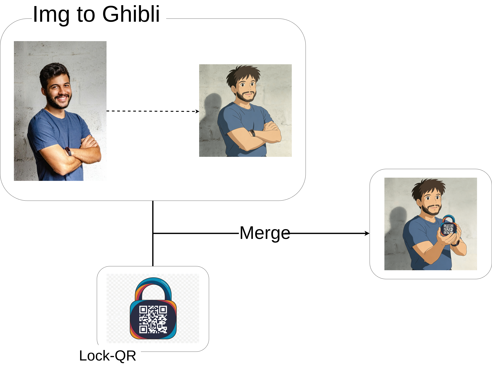
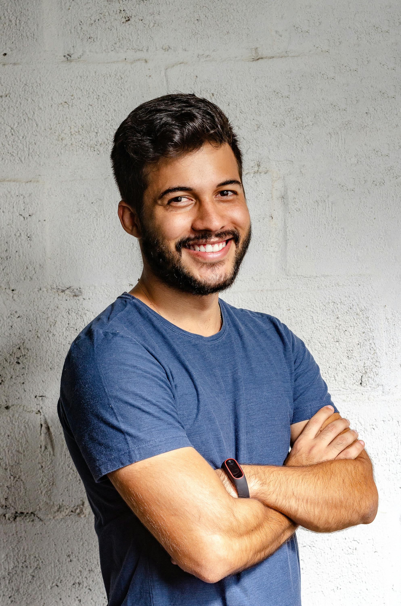
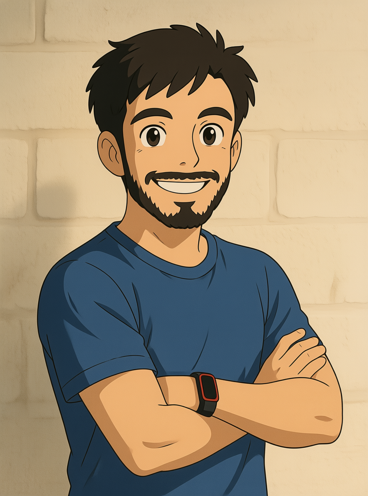
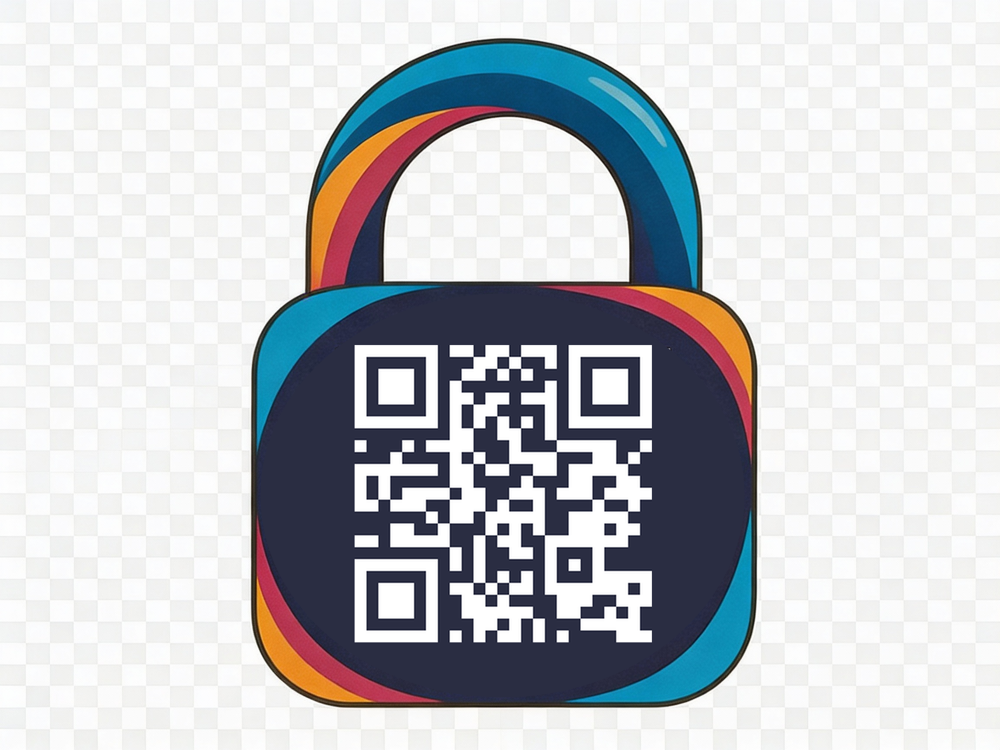
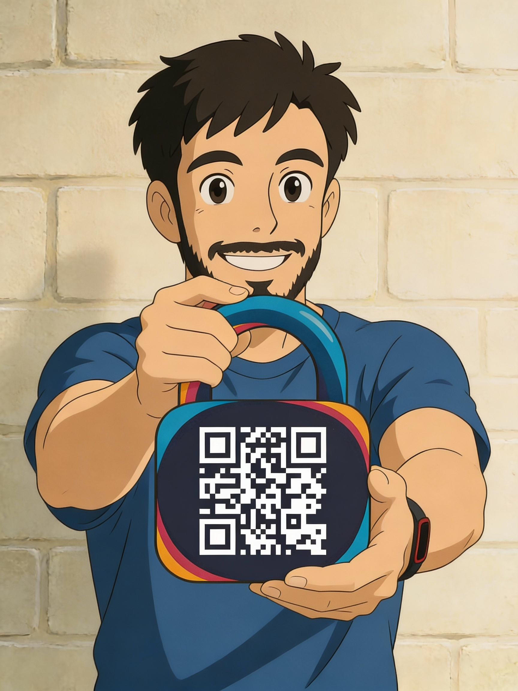

# Ghibli Portrait API - Usage Guide

Complete workflow for creating a Ghibli-style portrait holding a personalized QR lock.

## Overview

This API allows you to:
1. Transform a person's photo into Ghibli-style art
2. Generate a QR code embedded in a lock screen image
3. Combine both images into a final portrait showing the person holding their QR lock

## Complete Workflow

### Step 1: Convert Person Image to Ghibli Style

Transform the original person photo into Ghibli-style art.

**Endpoint:** `POST /ghibli`

**Request:**
```json
{
  "img_urls": [
    "https://images.pexels.com/photos/2379004/pexels-photo-2379004.jpeg"
  ],
  "prompt": "Convert this image to Ghibli style art.",
  "quality": "basic",
  "aspect_ratio": "1:1"
}
```

**Response:**
```json
{
  "code": 200,
  "msg": "Playground task completed successfully."
  "data": {
    "taskId": "af11b48786cb5bb6c09e3aecf148599f",
    "state": "success",
    "resultJson": "{\"urls\":[\"https://tempfile.aiquickdraw.com/f/a0b12df9-23d8-406e-b45e-6cfdfe9c9a58_0.png\"]}"
  }
}
```
<div style="display:flex; align-items:center; justify-content:center; gap:16px">
  
  <span style="font-size:28px">→</span>
  
</div>
---

### Step 2: Generate QR Lock Image

Create a QR code embedded in a lock screen that links to the user's profile.

**Endpoint:** `POST /qr-lock`

**Request:**
```json
{
  "url": "https://google.com",
  "version": null
}
```

**Response:**
```json
{
  "url": "https://your-domain.com/tmp/a6100b93-a8f8-4dce-90fc-39e900864a58.png"
}
```
<p align="center">
  
</p>

### Step 3: Merge Ghibli Portrait with QR Lock

Combine the Ghibli-style person image with the QR lock image.

**Endpoint:** `POST /ghibli`

**Request:**
```json
{
  "img_urls": [
    "https://tempfile.aiquickdraw.com/f/a0b12df9-23d8-406e-b45e-6cfdfe9c9a58_0.png",
    "https://your-domain.com/tmp/a6100b93-a8f8-4dce-90fc-39e900864a58.png"
  ],
  "prompt": "Make me holding this lock in my hands.",
  "quality": "basic",
  "aspect_ratio": "1:1"
}
```

**Response:**
```json
{
  "code": 200,
  "msg": "success",
  "data": {
    "taskId": "bf22c59897dc6cc7d10f4becf259600g",
    "state": "success",
    "resultJson": "{\"urls\":[\"https://cdn.example.com/final-portrait.jpeg\"]}"
  }
}
```
<p align="center">
  
</p>

---

## Customization Options

### Quality Settings
- `"basic"` - 2K resolution (faster, recommended)
- `"high"` - 4K resolution (slower, higher quality)

### Aspect Ratios
- `"1:1"` - Square (Instagram)
- `"4:3"` - Traditional photo
- `"3:4"` - Portrait
- `"16:9"` - Widescreen
- `"9:16"` - Vertical video
- `"2:3"` - Standard portrait
- `"3:2"` - Standard landscape
- `"21:9"` - Cinematic

### Prompt Variations

**Step 3 Creative Prompts:**
- `"Make me holding this lock in my hands."`
- `"Show me presenting this lock screen elegantly."`
- `"Place the lock floating in front of me with magical glow."`
- `"Make me pointing at this lock screen with a smile."`
- `"Show the lock screen as a magical artifact I'm holding."`

---

## Cleanup

Delete the temporary QR lock image when done:

```bash
DELETE /qr-lock/{img_id}
```

---

## Error Handling

**Task Failed:**
```json
{
  "code": 501,
  "msg": "Task failed",
  "data": {
    "state": "fail",
    "failCode": "ERROR_CODE",
    "failMsg": "Detailed error message"
  }
}
```

**Timeout:**
If the Ghibli transformation takes too long, the request will timeout. Retry with the same images or check the external API status.

**Invalid QR URL:**
Ensure the URL is properly formatted and accessible:
```json
{
  "url": "https://3alababi.com/username"  // Valid
}
```

---

## Tips

1. **Image Quality:** Use high-resolution source images (at least 1024x1024) for best Ghibli results
2. **QR URL:** Keep URLs short for better QR code readability
3. **Prompt Engineering:** Be specific in Step 3 prompts for better composition
4. **Processing Time:** Each Ghibli transformation takes 40-60 seconds depending on quality

---

## Full Workflow Summary

```
Original Photo → [Step 1] → Ghibli Style Person
Profile URL → [Step 2] → QR Lock Image
Ghibli Person + QR Lock → [Step 3] → Final Portrait with Lock
```

**Total Processing Time:** ~ [90 - 120]s