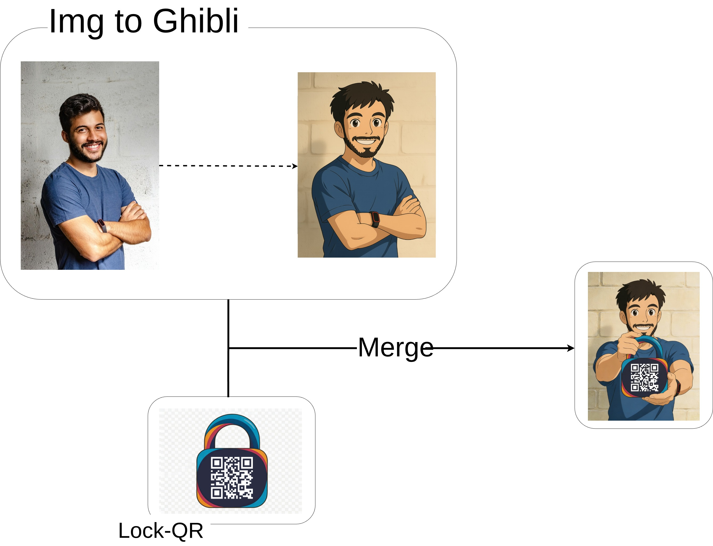

# Ghibli Portrait API - Usage Guide

Complete workflow for creating a Ghibli-style portrait holding a personalized QR lock.

## Overview

This API allows you to:
1. Transform a person's photo into Ghibli-style art
2. Generate a QR code embedded in a lock screen image (with optional URL shortening)
3. Combine both images into a final portrait showing the person holding their QR lock

**You can either:**
- Use the **automated pipeline** (`/ghibli-qr`) for a single-request workflow
- Follow the **manual 3-step process** for more control and customization

## Health Check

Check if the service is running:

**Endpoint:** `GET /health`

**Response:**
```json
{
  "code": 200,
  "message": "Service is running",
  "data": {
    "status": "healthy",
    "timestamp": "2024-01-15T10:30:00"
  }
}
```

## Complete Workflow

### Step 1: Convert Person Image to Ghibli Style

Transform the original person photo into Ghibli-style art.

**Endpoint:** `POST /ghibli`

**Request:**
```json
{
  "img_urls": [
    "https://images.pexels.com/photos/2379004/pexels-photo-2379004.jpeg"
  ],
  "prompt": "Convert this image to Ghibli style art.",
  "quality": "basic",
  "aspect_ratio": "1:1"
}
```

**Response:**
```json
{
  "code": 200,
  "message": "Playground task completed successfully.",
  "data": {
    "result_urls": [
      "https://tempfile.aiquickdraw.com/f/a0b12df9-23d8-406e-b45e-6cfdfe9c9a58_0.png"
    ],
    "cost_time": 45,
    "model": "seedream/4.5-edit",
    "quality": "basic",
    "aspect_ratio": "1:1"
  }
}
```
<div style="display:flex; align-items:center; justify-content:center; gap:16px">
  
  <span style="font-size:28px">→</span>
  
</div>

### Step 2: Generate QR Lock Image

Create a QR code embedded in a lock screen that links to the user's profile. Optionally shorten the URL for better QR code readability.

**Endpoint:** `POST /qr-lock`

**Request (without URL shortening):**
```json
{
  "url": "https://google.com",
  "version": null,
  "shorten_url": false
}
```

**Request (with URL shortening):**
```json
{
  "url": "https://very-long-domain.com/with/many/path/segments?and=query&parameters=here",
  "version": null,
  "shorten_url": true
}
```

**Response (without URL shortening):**
```json
{
  "code": 200,
  "message": "QR/Lock image created successfully.",
  "data": {
    "qr_url": "https://your-domain.com/tmp/a6100b93-a8f8-4dce-90fc-39e900864a58.png",
    "encoded_url": "https://google.com",
    "short_url": null
  }
}
```

**Response (with URL shortening):**
```json
{
  "code": 200,
  "message": "QR/Lock image created successfully.",
  "data": {
    "qr_url": "https://your-domain.com/tmp/a6100b93-a8f8-4dce-90fc-39e900864a58.png",
    "encoded_url": "https://very-long-domain.com/with/many/path/segments?and=query&parameters=here",
    "short_url": {
      "url": "https://your-domain.com/s/abc123",
      "code": "abc123"
    }
  }
}
```

**Parameters:**
- `url` (required): The URL to encode in the QR code
- `version` (optional): QR code version/size (null for auto)
- `shorten_url` (optional): Boolean to enable URL shortening (default: false)

<p align="center">
  
</p>

### Step 3: Merge Ghibli Portrait with QR Lock

Combine the Ghibli-style person image with the QR lock image.

**Endpoint:** `POST /ghibli`

**Request:**
```json
{
  "img_urls": [
    "https://tempfile.aiquickdraw.com/f/a0b12df9-23d8-406e-b45e-6cfdfe9c9a58_0.png",
    "https://your-domain.com/tmp/a6100b93-a8f8-4dce-90fc-39e900864a58.png"
  ],
  "prompt": "Make me holding this lock in my hands.",
  "quality": "basic",
  "aspect_ratio": "1:1"
}
```

**Response:**
```json
{
  "code": 200,
  "message": "Playground task completed successfully.",
  "data": {
    "result_urls": [
      "https://cdn.example.com/final-portrait.jpeg"
    ],
    "cost_time": 52,
    "model": "seedream/4.5-edit",
    "quality": "basic",
    "aspect_ratio": "1:1"
  }
}
```
<p align="center">
  
</p>

---

## URL Shortening

### Get Short URL for Any URL

Retrieve or generate a shortened URL using deterministic hashing. This endpoint always returns a short code for any given URL, using consistent hashing - the same URL will always produce the same short code.

**Endpoint:** `GET /qr-url/`

**Query Parameters:**
- `url` (required): The URL to shorten

**Example Request:**
```
GET /qr-url/?url=https://very-long-domain.com/with/many/path/segments
```

**Response:**
```json
{
  "code": 200,
  "message": "Short URL is retrieved successfully",
  "data": {
    "url": "https://your-domain.com/s/abc123",
    "code": "abc123"
  }
}
```

**Important Notes:**
- This endpoint uses deterministic hashing - the same URL always produces the same short code
- No validation is performed on the URL
- The endpoint returns a short code even for invalid or non-existent URLs
- Short codes are generated on-the-fly and don't require pre-registration
- Use this endpoint to recover previously generated short codes for any URL

**Use Cases:**
1. Pre-generate short codes before creating QR locks
2. Recover previously generated short codes
3. Check what short code a given URL maps to
4. Share shortened URLs independently of QR code generation

---

## Automated Pipeline

For convenience, use the automated endpoint that combines all three steps into one request.

**Endpoint:** `POST /ghibli-qr`

**Request:**
```json
{
  "img_url": "https://images.pexels.com/photos/2379004/pexels-photo-2379004.jpeg",
  "url": "https://google.com"
}
```

**Response:**
```json
{
  "code": 200,
  "message": "Playground task completed successfully.",
  "data": {
    "result_urls": [
      "https://cdn.example.com/final-portrait.jpeg"
    ],
    "cost_time": 97,
    "model": "seedream/4.5-edit",
    "quality": "basic",
    "aspect_ratio": "1:1"
  }
}
```

**Benefits:**
- Single API call instead of three
- Automatic cleanup of intermediate files
- Combined processing time tracking
- Simpler error handling

---

## Customization Options

### Quality Settings
- `"basic"` - 2K resolution (faster, recommended)
- `"high"` - 4K resolution (slower, higher quality)

### Aspect Ratios
- `"1:1"` - Square
- `"4:3"` - Traditional photo
- `"3:4"` - Portrait
- `"16:9"` - Widescreen
- `"9:16"` - Vertical video
- `"2:3"` - Standard portrait
- `"3:2"` - Standard landscape
- `"21:9"` - Cinematic

### Prompt Variations

**Step 3 Creative Prompts:**
- `"Make me holding this lock in my hands."`
- `"Show me presenting this lock screen elegantly."`
- `"Place the lock floating in front of me with magical glow."`
- `"Make me pointing at this lock screen with a smile."`
- `"Show the lock screen as a magical artifact I'm holding."`

---

## Cleanup

Delete the temporary QR lock image when done:

**Endpoint:** `DELETE /qr-lock/{img_id}`

**Example:**
```bash
DELETE /qr-lock/a6100b93-a8f8-4dce-90fc-39e900864a58
```

**Response:**
```json
{
  "code": 200,
  "message": "Image a6100b93-a8f8-4dce-90fc-39e900864a58 deleted successfully",
  "data": {
    "deleted_id": "a6100b93-a8f8-4dce-90fc-39e900864a58"
  }
}
```

---

## Error Handling

**Task Failed:**
```json
{
  "code": 501,
  "detail": "Task failed"
}
```

**Webhook Timeout:**
If the Ghibli transformation takes longer than 300 seconds (5 minutes), the request will timeout:
```json
{
  "detail": "Webhook timeout for task {task_id}"
}
```

**Invalid Request:**
```json
{
  "detail": "Validation error message"
}
```

**QR Image Not Found:**
```json
{
  "detail": "img {img_id} not exists."
}
```

---

## Internal Endpoints

### Webhook Callback
**Endpoint:** `POST /ghibli/callback`

This endpoint is called automatically by the external KIE API when image transformations complete. **Do not call this endpoint directly** - it's only for internal use by the image processing service.

---

## Tips

1. **Use Automated Pipeline:** For most use cases, `/ghibli-qr` is recommended for simplicity
2. **Image Quality:** Use high-resolution source images (at least 1024x1024) for best Ghibli results
3. **URL Shortening:** Enable `shorten_url: true` for long URLs to improve QR code readability and scannability
4. **Deterministic Short Codes:** The same URL always produces the same short code, making it easy to recover or reference previously generated links
5. **QR URL Length:** Shorter URLs create simpler QR codes that are easier to scan - consider using URL shortening for better results
6. **Prompt Engineering:** Use manual pipeline if you need custom prompts in Step 3 for better composition
7. **Processing Time:** Each Ghibli transformation takes 40-60 seconds depending on quality
8. **Timeout:** The API waits up to 5 minutes (300 seconds) for each transformation to complete

---

## Workflow Summary

### Automated Pipeline (Single Request)
```
POST /ghibli-qr
{
  "img_url": "person_photo.jpg",
  "url": "https://your-profile.com"
}
↓
Final Portrait with QR Lock
```
### Manual Pipeline (3 Separate Requests)
```
Original Photo → [Step 1: POST /ghibli] → Ghibli Style Person
Profile URL → [Step 2: POST /qr-lock] → QR Lock Image (with optional URL shortening)
Ghibli Person + QR Lock → [Step 3: POST /ghibli] → Final Portrait with Lock
```

### URL Shortening Workflow
```
Option 1: Standalone shortening
GET /qr-url/?url=https://long-url.com → Short URL (https://domain.com/s/abc123)

Option 2: During QR generation
POST /qr-lock with shorten_url: true → QR Lock + Short URL data
```

**Total Processing Time:** ~90-120s